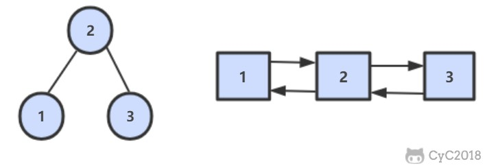

二叉搜索树与双向链表
====
[马上解题](https://www.nowcoder.com/practice/947f6eb80d944a84850b0538bf0ec3a5?tpId=13&tqId=11179&tPage=1&rp=1&ru=/ta/coding-interviews&qru=/ta/coding-interviews/question-ranking)

##### 题目描述   
输入一棵二叉搜索树，将该二叉搜索树转换成一个排序的双向链表。要求不能创建任何新的结点，只能调整树中结点指针的指向。


##### 解题思路


##### 代码
```java
 private TreeNode pre = null;
private TreeNode head = null;

public TreeNode convert(TreeNode root) {
    if (root == null) {
        return null;
    }
    inOrder(root);
    return head;
}

public void inOrder(TreeNode node) {
    if (node == null) {
        return;
    }
    inOrder(node.left);
    node.left = pre;
    if (pre != null) {
        pre.right = node;
    }
    pre = node;
    if (head == null) {
        head = pre;
    }
    inOrder(node.right);
}
```