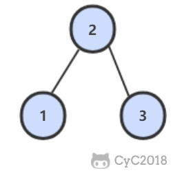

二叉搜索树的后序遍历序列
====


##### 题目描述   
输入一个整数数组，判断该数组是不是某二叉搜索树的后序遍历的结果。假设输入的数组的任意两个数字都互不相同。
例如，下图是后序遍历序列 1,3,2 所对应的二叉搜索树。

##### 解题思路


##### 代码
```java
public static boolean verifySequenceOfBST(int[] seq) {
        if (seq == null || seq.length == 0) {
            return false;
        }
        return verify(0, seq.length - 1, seq);
    }

    public static boolean verify(int start, int end, int[] seq) {
        if (end - start < 1) {
            return true;
        }
        int currentIdex = start;
        int lastIndexValue = seq[end];
        while (seq[currentIdex] < lastIndexValue) {
            currentIdex++;
        }
        for (int i = currentIdex; i < end; i++) {
            if (seq[currentIdex] > end) {
                return false;
            }
        }
        return verify(start, currentIdex-1, seq) && verify(currentIdex , end-1, seq);
    }
```