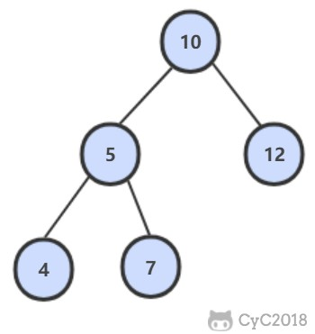

二叉树中和为某一值的路径
====
[马上解题](https://www.nowcoder.com/practice/b736e784e3e34731af99065031301bca?tpId=13&tqId=11177&tPage=1&rp=1&ru=/ta/coding-interviews&qru=/ta/coding-interviews/question-ranking)

##### 题目描述   
输入一颗二叉树和一个整数，打印出二叉树中结点值的和为输入整数的所有路径。路径定义为从树的根结点开始往下一直到叶结点所经过的结点形成一条路径。
下图的二叉树有两条和为 22 的路径：10, 5, 7 和 10, 12


##### 解题思路


##### 代码
```java
 public static List<List<Integer>> result = new ArrayList<>();

    public static List<List<Integer>> findPath(TreeNode root, int target) {
        bracking(root, target, new ArrayList<Integer>());
        return result;
    }

    public static void bracking(TreeNode node, int target, List<Integer> list) {
        if (node == null) {
            return;
        }
        list.add(node.val);
        target -= node.val;
        if (target == 0 && node.left == null && node.right == null) {
            result.add(list);
        } else {
            bracking(node.left, target, list);
            bracking(node.right, target, list);
        }
        list.remove(list.size() - 1);

    }
```