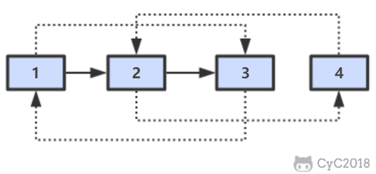
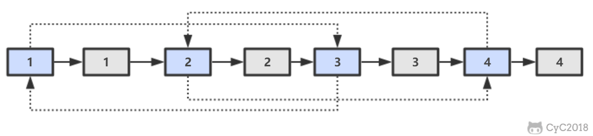
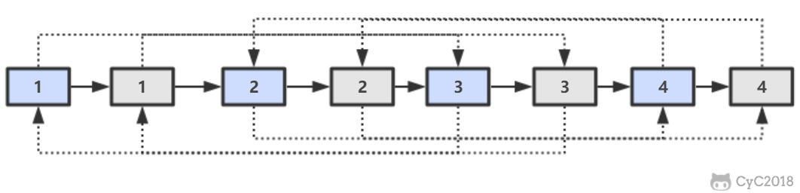
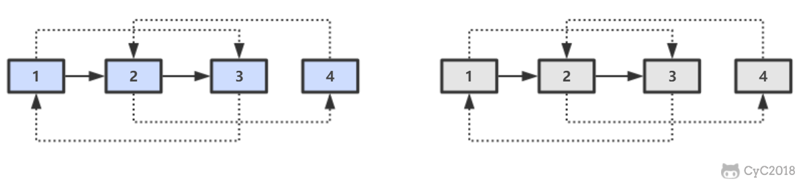

复杂链表的复制
====
[马上解题](https://www.nowcoder.com/practice/f836b2c43afc4b35ad6adc41ec941dba?tpId=13&tqId=11178&tPage=1&rp=1&ru=/ta/coding-interviews&qru=/ta/coding-interviews/question-ranking)

##### 题目描述   
输入一个复杂链表（每个节点中有节点值，以及两个指针，一个指向下一个节点，另一个特殊指针指向任意一个节点），返回结果为复制后复杂链表的 head。
```java
public class RandomListNode {
    public int val;
    public RandomListNode next = null;
    public RandomListNode random = null;

    public RandomListNode(int val){
        this.val = val;
    }
    
}
```


##### 解题思路
第一步，在每个节点的后面插入复制的节点。

第二步，对复制节点的 random 链接进行赋值。

第三步，拆分。


##### 代码
```java
public static RandomListNode copyRandomListNode(RandomListNode root) {
    if (root == null) {
        return null;
    }
    RandomListNode currNode = root;
    while (currNode != null) {
        RandomListNode node = new RandomListNode(currNode.val);
        node.next = currNode.next;
        currNode.next = node;
        currNode = node.next;
    }
    currNode = root;
    while (currNode != null) {
        RandomListNode next = currNode.next;
        if (currNode.next != null) {
            next.random = currNode.random.next;
        }
        currNode = next.next;
    }

    currNode = root;
    RandomListNode newRoot = currNode.next;
    while (currNode.next != null) {
        RandomListNode node = currNode.next;
        currNode.next = node.next;
        currNode = node;
    }

    return newRoot;
}
```