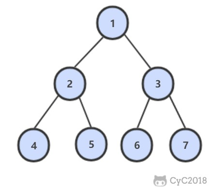

打印二叉树序列
====

##### 从上到下打印二叉树
[马上解题](https://www.nowcoder.com/practice/7fe2212963db4790b57431d9ed259701?tpId=13&tqId=11175&tPage=1&rp=1&ru=/ta/coding-interviews&qru=/ta/coding-interviews/question-ranking)

##### 题目描述   
从上往下打印出二叉树的每个节点，同层节点从左至右打印。
例如，以下二叉树层次遍历的结果为：1,2,3,4,5,6,7

##### 解题思路


##### 代码
```java
 public List<Integer> printTreeFromTopToButtom(TreeNode root) {
    List<Integer> result = new ArrayList<>();
    if (root == null) {
        return result;
    }
    Queue<TreeNode> queue = new ArrayDeque<>();
    queue.offer(root);
    while (!queue.isEmpty()) {
        TreeNode node = queue.poll();
        result.add(node.val);
        if (node.left != null) {
            queue.offer(node.left);
        }
        if (node.right != null) {
            queue.offer(node.right);
        }
    }
    return result;
}
```

##### 把二叉树打印成多行
[马上解题](https://leetcode-cn.com/problems/binary-tree-level-order-traversal/)

##### 题目描述   
给定一个二叉树，返回其按层次遍历的节点值。 （即逐层地，从左到右访问所有节点）。
##### 解题思路


##### 代码
```java
 public List<List<Integer>> levelOrder(TreeNode root) {
    List<List<Integer>> result = new ArrayList<>();
    if (root == null) {
        return result;
    }
    Queue<TreeNode> queue = new ArrayDeque<>();
    queue.offer(root);
    while (!queue.isEmpty()) {
        int size = queue.size();
        int index = 0;
        List<Integer> row = new ArrayList<>();
        while (index < size) {
            TreeNode node = queue.poll();
            row.add(node.val);
            if (node.left != null) {
                queue.add(node.left);
            }
            if (node.right != null) {
                queue.add(node.right);
            }
            index++;
        }
        result.add(row);
    }
    return result;
}
```

##### 按之字形顺序打印二叉树
[马上解题](https://www.nowcoder.com/practice/91b69814117f4e8097390d107d2efbe0?tpId=13&tqId=11212&tPage=1&rp=1&ru=/ta/coding-interviews&qru=/ta/coding-interviews/question-ranking)

##### 题目描述   
请实现一个函数按照之字形打印二叉树，即第一行按照从左到右的顺序打印，第二层按照从右至左的顺序打印，第三行按照从左到右的顺序打印，其他行以此类推。
##### 解题思路


##### 代码
```java
public List<List<Integer>> levelOfZOrder(TreeNode root) {
        List<List<Integer>> result = new ArrayList<>();
        if (root == null) {
            return result;
        }
        Queue<TreeNode> queue = new ArrayDeque<>();
        queue.offer(root);
        boolean revert = false;
        while (!queue.isEmpty()) {
            int size = queue.size();
            int index = 0;
            List<Integer> row = new ArrayList<>();
            while (index < size) {
                TreeNode node = queue.poll();
                row.add(node.val);
                if (node.left != null) {
                    queue.add(node.left);
                }
                if (node.right != null) {
                    queue.add(node.right);
                }
                index++;
            }
            if (revert) {
                Collections.reverse(row);
            }
            revert = !revert;
            result.add(row);
        }
        return result;
    }
```