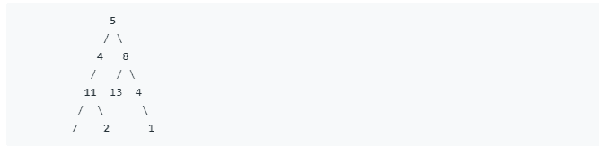
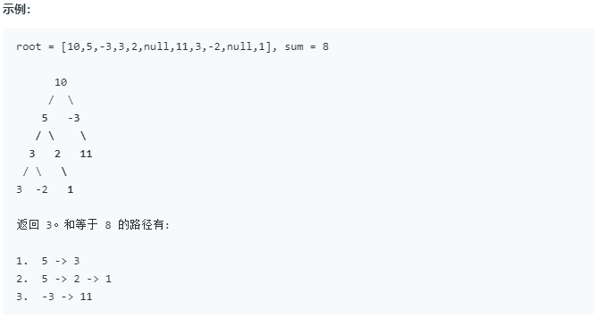

路径总和系列
====
#### 路径总和1


##### 题目描述   
给定一个二叉树和一个目标和，判断该树中是否存在根节点到叶子节点的路径，这条路径上所有节点值相加等于目标和。
说明:叶子节点是指没有子节点的节点。
示例:给定如下二叉树，以及目标和 sum = 22，返回 true, 因为存在目标和为 22 的根节点到叶子节点的路径 5->4->11->2。


##### 解题思路


##### 代码
```java
 public static boolean hasPathSum(TreeNode root, int target) {
        if (root == null) {
            return false;
        }
        if (root.val == target && root.left == null && root.right == null) {
            return true;
        }
        return hasPathSum(root.left, target - root.val) || hasPathSum(root.right, target - root.val);
    }
```

#### 路径总和2


##### 题目描述   
给定一个二叉树，它的每个结点都存放着一个整数值。找出路径和等于给定数值的路径总数。
路径不需要从根节点开始，也不需要在叶子节点结束，但是路径方向必须是向下的（只能从父节点到子节点）。
二叉树不超过1000个节点，且节点数值范围是 [-1000000,1000000] 的整数。


##### 解题思路


##### 代码
```java
    public static int pathSum(TreeNode root, int target) {
        if (root == null) {
            return 0;
        }
        return pathSumFrom(root, target) + pathSum(root.left, target) + pathSum(root.right, target);
    }

    public static int pathSumFrom(TreeNode node, int target) {
        if (node == null) {
            return 0;
        }
        return ((node.val == target) ? 1 : 0) + pathSum(node.left, target - node.val)
                + pathSum(node.right, target - node.val);
    }
```