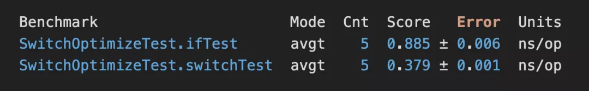
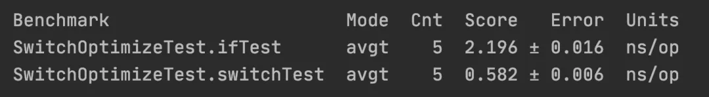
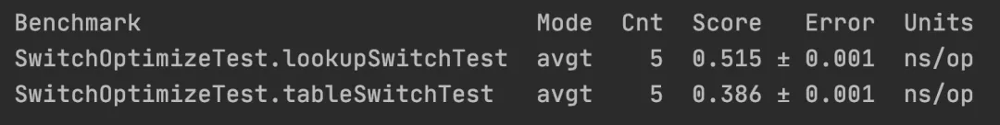

If和Switch的速度比较
====
#### 准备
我们借助 Oracle 官方提供的 JMH（Java Microbenchmark Harness，JAVA 微基准测试套件）框架来进行测试，首先引入 JMH 框架，在 pom.xml 文件中添加如下配置：
```java
<!-- https://mvnrepository.com/artifact/org.openjdk.jmh/jmh-core -->
<dependency>
   <groupId>org.openjdk.jmh</groupId>
   <artifactId>jmh-core</artifactId>
   <version>1.23</version>
</dependency>
```
然后编写测试代码，我们这里添加 5 个条件判断分支，具体实现代码如下：
```java
import org.openjdk.jmh.annotations.*;
import org.openjdk.jmh.runner.Runner;
import org.openjdk.jmh.runner.RunnerException;
import org.openjdk.jmh.runner.options.Options;
import org.openjdk.jmh.runner.options.OptionsBuilder;

import java.util.concurrent.TimeUnit;

@BenchmarkMode(Mode.AverageTime) // 测试完成时间
@OutputTimeUnit(TimeUnit.NANOSECONDS)
@Warmup(iterations = 2, time = 1, timeUnit = TimeUnit.SECONDS) // 预热 2 轮，每次 1s
@Measurement(iterations = 5, time = 1, timeUnit = TimeUnit.SECONDS) // 测试 5 轮，每次 3s
@Fork(1) // fork 1 个线程
@State(Scope.Thread) // 每个测试线程一个实例
public class SwitchOptimizeTest {

    static Integer _NUM = 9;

    public static void main(String[] args) throws RunnerException {
        // 启动基准测试
        Options opt = new OptionsBuilder()
                .include(SwitchOptimizeTest.class.getSimpleName()) // 要导入的测试类
                .output("/Users/admin/Desktop/jmh-switch.log") // 输出测试结果的文件
                .build();
        new Runner(opt).run(); // 执行测试
    }

    @Benchmark
    public void switchTest() {
        int num1;
        switch (_NUM) {
            case 1:
                num1 = 1;
                break;
            case 3:
                num1 = 3;
                break;
            case 5:
                num1 = 5;
                break;
            case 7:
                num1 = 7;
                break;
            case 9:
                num1 = 9;
                break;
            default:
                num1 = -1;
                break;
        }
    }

    @Benchmark
    public void ifTest() {
        int num1;
        if (_NUM == 1) {
            num1 = 1;
        } else if (_NUM == 3) {
            num1 = 3;
        } else if (_NUM == 5) {
            num1 = 5;
        } else if (_NUM == 7) {
            num1 = 7;
        } else if (_NUM == 9) {
            num1 = 9;
        } else {
            num1 = -1;
        }
    }
}
```
以上代码的测试结果如下:


    备注：本文的测试环境为：JDK 1.8 / Mac mini (2018) / Idea 2020.1
从以上结果可以看出（Score 列），switch 的平均执行完成时间比 if 的平均执行完成时间快了约 2.33 倍。

#### 性能分析
为什么 switch 的性能会比 if 的性能高这么多？
这需要从他们字节码说起，我们把他们的代码使用 javac 生成字节码如下所示：
```c
public class com.example.optimize.SwitchOptimize {
  static java.lang.Integer _NUM;

  public com.example.optimize.SwitchOptimize();
    Code:
       0: aload_0
       1: invokespecial #1                  // Method java/lang/Object."<init>":()V
       4: return

  public static void main(java.lang.String[]);
    Code:
       0: invokestatic  #7                  // Method switchTest:()V
       3: invokestatic  #12                 // Method ifTest:()V
       6: return

  public static void switchTest();
    Code:
       0: getstatic     #15                 // Field _NUM:Ljava/lang/Integer;
       3: invokevirtual #19                 // Method java/lang/Integer.intValue:()I
       6: tableswitch   { // 1 to 9
                     1: 56
                     2: 83
                     3: 61
                     4: 83
                     5: 66
                     6: 83
                     7: 71
                     8: 83
                     9: 77
               default: 83
          }
      56: iconst_1
      57: istore_0
      58: goto          85
      61: iconst_3
      62: istore_0
      63: goto          85
      66: iconst_5
      67: istore_0
      68: goto          85
      71: bipush        7
      73: istore_0
      74: goto          85
      77: bipush        9
      79: istore_0
      80: goto          85
      83: iconst_m1
      84: istore_0
      85: return

  public static void ifTest();
    Code:
       0: getstatic     #15                 // Field _NUM:Ljava/lang/Integer;
       3: invokevirtual #19                 // Method java/lang/Integer.intValue:()I
       6: iconst_1
       7: if_icmpne     15
      10: iconst_1
      11: istore_0
      12: goto          81
      15: getstatic     #15                 // Field _NUM:Ljava/lang/Integer;
      18: invokevirtual #19                 // Method java/lang/Integer.intValue:()I
      21: iconst_3
      22: if_icmpne     30
      25: iconst_3
      26: istore_0
      27: goto          81
      30: getstatic     #15                 // Field _NUM:Ljava/lang/Integer;
      33: invokevirtual #19                 // Method java/lang/Integer.intValue:()I
      36: iconst_5
      37: if_icmpne     45
      40: iconst_5
      41: istore_0
      42: goto          81
      45: getstatic     #15                 // Field _NUM:Ljava/lang/Integer;
      48: invokevirtual #19                 // Method java/lang/Integer.intValue:()I
      51: bipush        7
      53: if_icmpne     62
      56: bipush        7
      58: istore_0
      59: goto          81
      62: getstatic     #15                 // Field _NUM:Ljava/lang/Integer;
      65: invokevirtual #19                 // Method java/lang/Integer.intValue:()I
      68: bipush        9
      70: if_icmpne     79
      73: bipush        9
      75: istore_0
      76: goto          81
      79: iconst_m1
      80: istore_0
      81: return

  static {};
    Code:
       0: iconst_1
       1: invokestatic  #25                 // Method java/lang/Integer.valueOf:(I)Ljava/lang/Integer;
       4: putstatic     #15                 // Field _NUM:Ljava/lang/Integer;
       7: return
}

```

这些字节码中最重要的信息是“getstatic     #15”，这段代码表示取出“_NUM”变量和条件进行判断。
从上面的字节码可以看出，<font color="red" size="4">在 switch 中只取出了一次变量和条件进行比较，而 if 中每次都会取出变量和条件进行比较，因此 if 的效率就会比 switch 慢很多。</font>

#### 提升测试量
前面的测试代码我们使用了 5 个分支条件来测试了 if 和 switch 的性能，那如果把分支的判断条件增加 3 倍（15 个）时，测试的结果又会怎么呢？

增加至 15 个分支判断的实现代码如下：
```java
package com.example.optimize;

import org.openjdk.jmh.annotations.*;
import org.openjdk.jmh.runner.Runner;
import org.openjdk.jmh.runner.RunnerException;
import org.openjdk.jmh.runner.options.Options;
import org.openjdk.jmh.runner.options.OptionsBuilder;

import java.util.concurrent.TimeUnit;

@BenchmarkMode(Mode.AverageTime) // 测试完成时间
@OutputTimeUnit(TimeUnit.NANOSECONDS)
@Warmup(iterations = 2, time = 1, timeUnit = TimeUnit.SECONDS) // 预热 2 轮，每次 1s
@Measurement(iterations = 5, time = 1, timeUnit = TimeUnit.SECONDS) // 测试 5 轮，每次 3s
@Fork(1) // fork 1 个线程
@State(Scope.Thread) // 每个测试线程一个实例
public class SwitchOptimizeTest {

    static Integer _NUM = 1;

    public static void main(String[] args) throws RunnerException {
        // 启动基准测试
        Options opt = new OptionsBuilder()
                .include(SwitchOptimizeTest.class.getSimpleName()) // 要导入的测试类
                .output("/Users/admin/Desktop/jmh-switch.log") // 输出测试结果的文件
                .build();
        new Runner(opt).run(); // 执行测试
    }

    @Benchmark
    public void switchTest() {
        int num1;
        switch (_NUM) {
            case 1:
                num1 = 1;
                break;
            case 2:
                num1 = 2;
                break;
            case 3:
                num1 = 3;
                break;
            case 4:
                num1 = 4;
                break;
            case 5:
                num1 = 5;
                break;
            case 6:
                num1 = 6;
                break;
            case 7:
                num1 = 7;
                break;
            case 8:
                num1 = 8;
                break;
            case 9:
                num1 = 9;
                break;
            case 10:
                num1 = 10;
                break;
            case 11:
                num1 = 11;
                break;
            case 12:
                num1 = 12;
                break;
            case 13:
                num1 = 13;
                break;
            case 14:
                num1 = 14;
                break;
            case 15:
                num1 = 15;
                break;
            default:
                num1 = -1;
                break;
        }
    }

    @Benchmark
    public void ifTest() {
        int num1;
        if (_NUM == 1) {
            num1 = 1;
        } else if (_NUM == 2) {
            num1 = 2;
        } else if (_NUM == 3) {
            num1 = 3;
        } else if (_NUM == 4) {
            num1 = 4;
        } else if (_NUM == 5) {
            num1 = 5;
        } else if (_NUM == 6) {
            num1 = 6;
        } else if (_NUM == 7) {
            num1 = 7;
        } else if (_NUM == 8) {
            num1 = 8;
        } else if (_NUM == 9) {
            num1 = 9;
        } else if (_NUM == 10) {
            num1 = 10;
        } else if (_NUM == 11) {
            num1 = 11;
        } else if (_NUM == 12) {
            num1 = 12;
        } else if (_NUM == 13) {
            num1 = 13;
        } else if (_NUM == 14) {
            num1 = 14;
        } else if (_NUM == 15) {
            num1 = 15;
        } else {
            num1 = -1;
        }
    }
}
```
以上代码的测试结果如下：

从 Score 的值可以看出，当分支判断增加至 15 个，switch 的性能比 if 的性能高出了约 3.7 倍，而之前有 5 个分支判断时的测试结果为，switch 的性能比 if 的性能高出了约 2.3 倍，也就是说<font color="red" size="4">分支的判断条件越多，switch 性能高的特性体现的就越明显。</font>

#### switch详情
对于 switch 来说，他最终生成的字节码有两种形态，一种是 tableswitch，另一种是 lookupswitch，决定最终生成的代码使用那种形态取决于 switch 的判断添加是否紧凑，例如到 case 是 1...2...3...4 这种依次递增的判断条件时，使用的是 tableswitch，而像 case 是 1...33...55...22 这种非紧凑型的判断条件时则会使用 lookupswitch，测试代码如下：
```java
public class SwitchOptimize {
    static Integer _NUM = 1;
    public static void main(String[] args) {
        tableSwitchTest();
        lookupSwitchTest();
    }
    public static void tableSwitchTest() {
        int num1;
        switch (_NUM) {
            case 1:
                num1 = 1;
                break;
            case 2:
                num1 = 2;
                break;
            case 3:
                num1 = 3;
                break;
            case 4:
                num1 = 4;
                break;
            case 5:
                num1 = 5;
                break;
            case 6:
                num1 = 6;
                break;
            case 7:
                num1 = 7;
                break;
            case 8:
                num1 = 8;
                break;
            case 9:
                num1 = 9;
                break;
            default:
                num1 = -1;
                break;
        }
    }
    public static void lookupSwitchTest() {
        int num1;
        switch (_NUM) {
            case 1:
                num1 = 1;
                break;
            case 11:
                num1 = 2;
                break;
            case 3:
                num1 = 3;
                break;
            case 4:
                num1 = 4;
                break;
            case 19:
                num1 = 5;
                break;
            case 6:
                num1 = 6;
                break;
            case 33:
                num1 = 7;
                break;
            case 8:
                num1 = 8;
                break;
            case 999:
                num1 = 9;
                break;
            default:
                num1 = -1;
                break;
        }
    }
}
```
对应的字节码如下：
```java
public class com.example.optimize.SwitchOptimize {
  static java.lang.Integer _NUM;

  public com.example.optimize.SwitchOptimize();
    Code:
       0: aload_0
       1: invokespecial #1                  // Method java/lang/Object."<init>":()V
       4: return

  public static void main(java.lang.String[]);
    Code:
       0: invokestatic  #7                  // Method tableSwitchTest:()V
       3: invokestatic  #12                 // Method lookupSwitchTest:()V
       6: return

  public static void tableSwitchTest();
    Code:
       0: getstatic     #15                 // Field _NUM:Ljava/lang/Integer;
       3: invokevirtual #19                 // Method java/lang/Integer.intValue:()I
       6: tableswitch   { // 1 to 9
                     1: 56
                     2: 61
                     3: 66
                     4: 71
                     5: 76
                     6: 81
                     7: 87
                     8: 93
                     9: 99
               default: 105
          }
      56: iconst_1
      57: istore_0
      58: goto          107
      61: iconst_2
      62: istore_0
      63: goto          107
      66: iconst_3
      67: istore_0
      68: goto          107
      71: iconst_4
      72: istore_0
      73: goto          107
      76: iconst_5
      77: istore_0
      78: goto          107
      81: bipush        6
      83: istore_0
      84: goto          107
      87: bipush        7
      89: istore_0
      90: goto          107
      93: bipush        8
      95: istore_0
      96: goto          107
      99: bipush        9
     101: istore_0
     102: goto          107
     105: iconst_m1
     106: istore_0
     107: return

  public static void lookupSwitchTest();
    Code:
       0: getstatic     #15                 // Field _NUM:Ljava/lang/Integer;
       3: invokevirtual #19                 // Method java/lang/Integer.intValue:()I
       6: lookupswitch  { // 9
                     1: 88
                     3: 98
                     4: 103
                     6: 113
                     8: 125
                    11: 93
                    19: 108
                    33: 119
                   999: 131
               default: 137
          }
      88: iconst_1
      89: istore_0
      90: goto          139
      93: iconst_2
      94: istore_0
      95: goto          139
      98: iconst_3
      99: istore_0
     100: goto          139
     103: iconst_4
     104: istore_0
     105: goto          139
     108: iconst_5
     109: istore_0
     110: goto          139
     113: bipush        6
     115: istore_0
     116: goto          139
     119: bipush        7
     121: istore_0
     122: goto          139
     125: bipush        8
     127: istore_0
     128: goto          139
     131: bipush        9
     133: istore_0
     134: goto          139
     137: iconst_m1
     138: istore_0
     139: return

  static {};
    Code:
       0: iconst_1
       1: invokestatic  #25                 // Method java/lang/Integer.valueOf:(I)Ljava/lang/Integer;
       4: putstatic     #15                 // Field _NUM:Ljava/lang/Integer;
       7: return
}
```
从上面字节码可以看出 tableSwitchTest 使用的 tableswitch，而 lookupSwitchTest 则是使用的 lookupswitch。

#### tableswitch VS lookupSwitchTest
当执行一次 tableswitch 时，堆栈顶部的 int 值直接用作表中的索引，以便抓取跳转目标并立即执行跳转。也就是说 tableswitch 的存储结构类似于数组，是直接用索引获取元素的，所以整个查询的时间复杂度是 O(1)，这也意味着它的搜索速度非常快。

而执行 lookupswitch 时，会逐个进行分支比较或者使用二分法进行查询，因此查询时间复杂度是 O(log n)，所以使用 lookupswitch 会比 tableswitch 慢。

接下来我们使用实际的代码测试一下，他们两个之间的性能，测试代码如下：
```
package com.example.optimize;

import org.openjdk.jmh.annotations.*;
import org.openjdk.jmh.runner.Runner;
import org.openjdk.jmh.runner.RunnerException;
import org.openjdk.jmh.runner.options.Options;
import org.openjdk.jmh.runner.options.OptionsBuilder;

import java.util.concurrent.TimeUnit;

@BenchmarkMode(Mode.AverageTime) // 测试完成时间
@OutputTimeUnit(TimeUnit.NANOSECONDS)
@Warmup(iterations = 2, time = 1, timeUnit = TimeUnit.SECONDS) // 预热 2 轮，每次 1s
@Measurement(iterations = 5, time = 1, timeUnit = TimeUnit.SECONDS) // 测试 5 轮，每次 3s
@Fork(1) // fork 1 个线程
@State(Scope.Thread) // 每个测试线程一个实例
public class SwitchOptimizeTest {

    static Integer _NUM = -1;

    public static void main(String[] args) throws RunnerException {
        // 启动基准测试
        Options opt = new OptionsBuilder()
                .include(SwitchOptimizeTest.class.getSimpleName()) // 要导入的测试类
                .build();
        new Runner(opt).run(); // 执行测试
    }

    @Benchmark
    public void tableSwitchTest() {
        int num1;
        switch (_NUM) {
            case 1:
                num1 = 1;
                break;
            case 2:
                num1 = 2;
                break;
            case 3:
                num1 = 3;
                break;
            case 4:
                num1 = 4;
                break;
            case 5:
                num1 = 5;
                break;
            case 6:
                num1 = 6;
                break;
            case 7:
                num1 = 7;
                break;
            case 8:
                num1 = 8;
                break;
            case 9:
                num1 = 9;
                break;
            default:
                num1 = -1;
                break;
        }
    }

    @Benchmark
    public void lookupSwitchTest() {
        int num1;
        switch (_NUM) {
            case 1:
                num1 = 1;
                break;
            case 11:
                num1 = 2;
                break;
            case 3:
                num1 = 3;
                break;
            case 4:
                num1 = 4;
                break;
            case 19:
                num1 = 5;
                break;
            case 6:
                num1 = 6;
                break;
            case 33:
                num1 = 7;
                break;
            case 8:
                num1 = 8;
                break;
            case 999:
                num1 = 9;
                break;
            default:
                num1 = -1;
                break;
        }
    }
}

```
以上代码的测试结果如下：

可以看出在分支判断为 9 个时，<font color="red" size="4">tableswitch 的性能比 lookupwitch 的性能快了约 1.3 倍。但即使这样 lookupwitch 依然比 if 查询性能要高很多。</font>

#### 总结
switch 的判断条件是 5 个时，性能比 if 高出了约 2.3 倍，<font color="red" size="4">而当判断条件的数量越多时，他们的性能相差就越大</font>。而 switch 在编译为字节码时，会根据 switch 的判断条件是否紧凑生成两种代码：tableswitch（紧凑时生成）和 lookupswitch（非紧凑时生成），其中 tableswitch 是采用类似于数组的存储结构，直接根据索引查询元素；而 lookupswitch 则需要逐个查询或者使用二分法查询，<font color="red" size="4">因此 tableswitch 的性能会比 lookupswitch 的性能高，但无论如何 switch 的性能都比 if 的性能要高。</font>