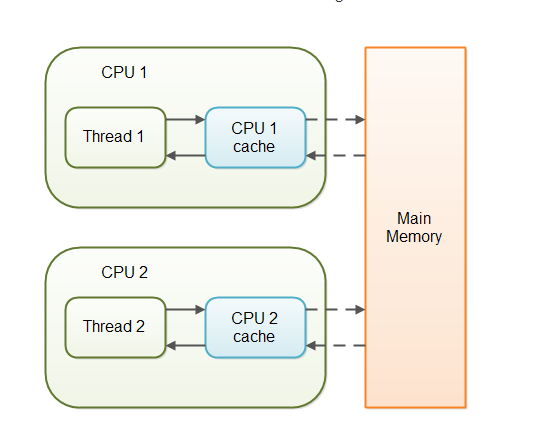

volatile
===
Java 语言提供了一种稍弱的同步机制，即 volatile 变量，用来确保将变量的更新操作通知到其他线程。volatile 变量具备两种特性，volatile 变量不会被缓存在寄存器或者对其他处理器不可见的地方，因此在读取 volatile 类型的变量时总会返回最新写入的值。
* 变量可见性
其一是保证该变量对所有线程可见，这里的可见性指的是当一个线程修改了变量的值，那么新的值对于其他线程是可以立即获取的。
* 禁止重排序
volatile 禁止了指令重排。 

比 sychronized 更轻量级的同步锁在访问 volatile 变量时不会执行加锁操作，因此也就不会使执行线程阻塞，因此 volatile 变量是一种比 sychronized 关键字更轻量级的同步机制。volatile 适合这种场景：一个变量被多个线程共享，线程直接给这个变量赋值。

当对非 volatile 变量进行读写的时候，每个线程先从内存拷贝变量到 CPU 缓存中。如果计算机有多个 CPU，每个线程可能在不同的 CPU 上被处理，这意味着每个线程可以拷贝到不同的 CPU cache 中。而声明变量是 volatile 的，JVM 保证了每次读变量都从内存中读，跳过 CPU cache 这一步。
#### 适用场景
值得说明的是对 volatile 变量的单次读/写操作可以保证原子性的，如 long 和 double 类型变量，但是并不能保证 i++这种操作的原子性，因为本质上 i++是读、写两次操作。在某些场景下可以代替 Synchronized。但是,volatile 的不能完全取代 Synchronized 的位置，只有在一些特殊的场景下，才能适用 volatile。总的来说，必须同时满足下面两个条件才能保证在并发环境的线程安全：
* 对变量的写操作不依赖于当前值（比如 i++），或者说是单纯的变量赋值（boolean flag = true）。 
* 该变量没有包含在具有其他变量的不变式中，也就是说，不同的 volatile 变量之间，不能互相依赖。只有在状态真正独立于程序内其他内容时才能使用 volatile。