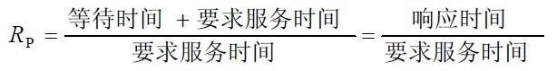

进程调度算法
===
#### 优先调度算法
1. 先来先服务调度算法（FCFS）
当在作业调度中采用该算法时，每次调度都是从后备作业队列中选择一个或多个最先进入该队列的作业，将它们调入内存，为它们分配资源、创建进程，然后放入就绪队列。在进程调度中采用FCFS 算法时，则每次调度是从就绪队列中选择一个最先进入该队列的进程，为之分配处理机，使之投入运行。该进程一直运行到完成或发生某事件而阻塞后才放弃处理机，特点是：算法比较简单，可以实现基本上的公平。
2. 短作业(进程)优先调度算法
短作业优先(SJF)的调度算法是从后备队列中选择一个或若干个估计运行时间最短的作业，将它们调入内存运行。而短进程优先(SPF)调度算法则是从就绪队列中选出一个估计运行时间最短的进程，将处理机分配给它，使它立即执行并一直执行到完成，或发生某事件而被阻塞放弃处理机时再重新调度。该算法未照顾紧迫型作业。
#### 高优先权优先调度算法
为了照顾紧迫型作业，使之在进入系统后便获得优先处理，引入了最高优先权优先(FPF)调度算法。当把该算法用于作业调度时，系统将从后备队列中选择若干个优先权最高的作业装入内存。当用于进程调度时，该算法是把处理机分配给就绪队列中优先权最高的进程。
1. 非抢占式优先权算法
在这种方式下，系统一旦把处理机分配给就绪队列中优先权最高的进程后，该进程便一直执行下去，直至完成；或因发生某事件使该进程放弃处理机时。这种调度算法主要用于批处理系统中；也可用于某些对实时性要求不严的实时系统中。
2. 抢占式优先权调度算法
在这种方式下，系统同样是把处理机分配给优先权最高的进程，使之执行。但在其执行期间，只要又出现了另一个其优先权更高的进程，进程调度程序就立即停止当前进程(原优先权最高的进程)的执行，重新将处理机分配给新到的优先权最高的进程。显然，这种抢占式的优先权调度算法能更好地满足紧迫作业的要求，故而常用于要求比较严格的实时系统中，以及对性能要求较高的批处理和分时系统中。
3. 高响应比优先调度算法
在批处理系统中，短作业优先算法是一种比较好的算法，其主要的不足之处是长作业的运行得不到保证。如果我们能为每个作业引入前面所述的动态优先权，并使作业的优先级随着等待时间的增加而以速率a 提高，则长作业在等待一定的时间后，必然有机会分配到处理机。该优先权的变化规律可描述为：

   * 如果作业的等待时间相同，则要求服务的时间愈短，其优先权愈高，因而该算法有利于短作业。
   * 当要求服务的时间相同时，作业的优先权决定于其等待时间，等待时间愈长，其优先权愈高，因而它实现的是先来先服务。
   * 对于长作业，作业的优先级可以随等待时间的增加而提高，当其等待时间足够长时，其优先级便可升到很高，从而也可获得处理机。简言之，该算法既照顾了短作业，又考虑了作业到达的先后次序，不会使长作业长期得不到服务。因此，该算法实现了一种较好的折衷。当然，在利用该算法时，每要进行调度之前，都须先做响应比的计算，这会增加系统开销。
   * 对于长作业，作业的优先级可以随等待时间的增加而提高，当其等待时间足够长时，其优先级便可升到很高，从而也可获得处理机。简言之，该算法既照顾了短作业，又考虑了作业到达的先后次序，不会使长作业长期得不到服务。因此，该算法实现了一种较好的折衷。当然，在利用该算法时，每要进行调度之前，都须先做响应比的计算，这会增加系统开销。

#### 基于时间片的轮转调度算法
1. 时间片轮转法
在早期的时间片轮转法中，系统将所有的就绪进程按先来先服务的原则排成一个队列，每次调度时，把CPU 分配给队首进程，并令其执行一个时间片。时间片的大小从几ms 到几百ms。当执行的时间片用完时，由一个计时器发出时钟中断请求，调度程序便据此信号来停止该进程的执行，并将它送往就绪队列的末尾；然后，再把处理机分配给就绪队列中新的队首进程，同时也让它执行一个时间片。这样就可以保证就绪队列中的所有进程在一给定的时间内均能获得一时间片的处理机执行时间。
2. 多级反馈队列调度算法
   * 应设置多个就绪队列，并为各个队列赋予不同的优先级。第一个队列的优先级最高，第二个队列次之，其余各队列的优先权逐个降低。该算法赋予各个队列中进程执行时间片的大小也各不相同，在优先权愈高的队列中，为每个进程所规定的执行时间片就愈小。例如，第二个队列的时间片要比第一个队列的时间片
   * 当一个新进程进入内存后，首先将它放入第一队列的末尾，按FCFS 原则排队等待调度。当轮到该进程执行时，如它能在该时间片内完成，便可准备撤离系统；如果它在一个时间片结束时尚未完成，调度程序便将该进程转入第二队列的末尾，再同样地按FCFS 原则等待调度执行；如果它在第二队列中运行一个时间片后仍未完成，再依次将它放入第三队列，……，如此下去，当一个长作业(进程)从第一队列依次降到第n 队列后，在第n 队列便采取按时间片轮转的方式运行。
   * 仅当第一队列空闲时，调度程序才调度第二队列中的进程运行；仅当第1～(i-1)队列均空时，才会调度第i 队列中的进程运行。如果处理机正在第i 队列中为某进程服务时，又有新进程进入优先权较高的队列(第1～(i-1)中的任何一个队列)，则此时新进程将抢占正在运行进程的处理机，即由调度程序把正在运行的进程放回到第i 队列的末尾，把处理机分配给新到的高优先权进程。在多级反馈队列调度算法中，如果规定第一个队列的时间片略大于多数人机交互所需之处理时间时，便能够较好的满足各种类型用户的需要。