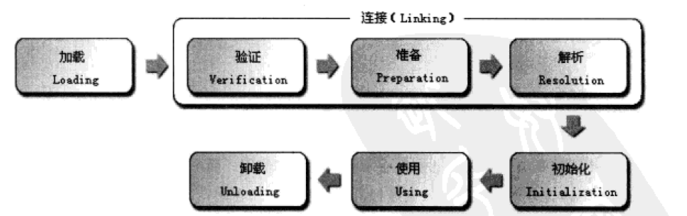

类加载机制
====
##### 概述
虚拟机把描述类的数据从Class文件加载到内存，并对数据进行校验，转换解析和初始化，最终形成可以被虚拟机直接使用的Java类型，这就是虚拟机的类加载机制。
##### 类的生命周期
类的生命周期包括了加载-验证-准备-解析-初始化-使用-卸载七个阶段，其中验证-准备-解析统称为连接。

##### 类加载过程
1. 加载
加载阶段，虚拟机需要完成三件事情：
* 通过一个类的全限定名来获取定义此类的二进制字节流；包括从ZIP包获取，从网络获取，运行时计算生成（动态代理就用到了），由其他文件生成，数据库中读取等。
* 将这个字节流所代表的静态存储结构转换为方法区的运行时数据结构；
* 在Java堆中生成一个代表这个类的Java.lang.Class对象，作为方法区这些数据的访问入口。
2. 验证
* 文件格式验证：
    是否以模式0xCOFEBABE开头；
    主次版本号是否在当前虚拟机的处理范围之类；
    常量池的常量中是否有不被支持的常量类型；
    指向常量的各种索引值中是否有指向不存在的常量或不符合类型的常量。
    ......
* 元数据的验证
    验证这个类是否有父类；
    验证这个类的父类是否继承了不允许被继承的类；
    如果这个类不是抽象类，是否实现了其父类或接口之中要求实现的所有方法；
    类的字段、方法是否与父类发生了矛盾。
    ......
* 字节码的验证
    第二阶段对元数据信息中的数据类型验证后，这里就是对类的方法体进行验证。
    保证任意时刻操作数栈的数据类型与指令代码序列都能配合工作；
    保证跳转指令不会跳转到方法体以外的字节码指令上；
    保证方法体中的类型转换是有效的。
    ......
* 符号引用验证
    符号引用中通过字符串藐视的全限定名是否能找到对应的类；
    在指定类中是否存在符合方法的字段描述符及简单名称所描述的方法和字段
    符号引用中的类、字段。和方法的访问性是否可被当前类访问。
    ......
3. 准备
准备阶段是正式为类变量分配内存并设置类变量初始值的阶段，这些内存都将在方法区中进行分配。
这个阶段内存分配的只是类变量（static修饰的变量），不包括实例变量。
public static int value =123；在准备阶段后初始值是0，不是123。
如果类字段的字段属性表中存在ConstantValue属性，那么在准备阶段变量value就会被初始化为ConstantValue属性所指定的值。
如public static final int value =123；在准备阶段后value的值就是123。
4. 解析
解析阶段是虚拟机将常量池类的符号引用替换为直接引用的过程。
符号引用：以一组符号来描述所引用的目标，符号可以是人和形式的字面量，只要使用时能无歧义的定位到目标即可。
直接引用：直接引用可以是直接指向目标的指针、相对偏移量或是一个能间接定位到目标的句柄。
5. 初始化
初始化阶段，才真正开始执行类中定义的Java程序代码。通过程序制定的主观计划去初始化类变量和其他资源。包括给类变量赋值，初始化实例变量，给实例变量赋值等操作。
##### 类加载器
类加载阶段中的“通过一个类的全限定名来获取描述此类的二进制字节流”动作是在Java虚拟机外部实现的，以便让应用程序自己决定如何去获取所需要的类，实现这个动作的代码模块被称为“类加载器”。
对于任意一个类，都需要由加载它的类加载器和这个类本身一同确立其在Java虚拟机中的唯一性，即比较两个类是否一样，只有再这两个类由同一个类加载器加载的前提之下才有意义。
1. 类加载器
在Java虚拟机的角度，只有两种不同的类加载器，一种是启动类加载器，Bootstrap ClassLoader，这个类加载器是C++实现的，是虚拟机自身的一部分；另外一种就是所有其他的类加载器，这些类加载器都是由Java实现，独立于虚拟机外部，都继承自抽象类java.lang.ClassLoader。
而在开发人员看来，很多Java程序都会使用到三种系统提供的类加载器：
* 启动类加载器Bootstrap ClassLoader，这个类加载器负责将放在<JAVA_HOME>\bin目录中的，或者被-Xbootclasspath参数指定路径中的，并且是虚拟机识别（名字不符合的类库即使放在lib目录中也不会被加载）的类库加载到虚拟机内存中。启动类加载器无法被Java程序直接引用。
* 扩展类加载器 Extension ClassLoader，这个类加载器负责加载<JAVA_HOME>\lib\ext目录中的，或者被java.ext.dirs系统变量所制定的路径中的所有类库，开发者可以张家界使用扩展类加载器。
* 应用程序类加载器Application ClassLoader，这个类加载器是ClassLoader中的getSystemClassLoader()方法的返回值，一般也称为系统类加载器。它负责加载用户类路径（ClassPath）上指定的类库。开发者可以直接使用这个类加载器，如果应用程序中没有定义过自己的类加载器，一般情况下这个就是默认的类加载器。
2. 双亲委派原型
双亲委派模型要求除了顶层的启动类加载器外，其余的类加载器都应当有自己的父类加载器，这里类加载器之间的父子关系一般是使用组合关系来复用父加载器的代码。

双亲委派模型的工作过程：如果一个类加载器收到了类加载的请求，它首先不会自己去尝试加载这个类，而是把这个请求委派给父类加载器去完成，每一个层次的类加载器都是如此，因此所有的加载请求最终都应该传送到顶层的启动类加载器中，只有当父类加载器反馈自己无法完成这个加载请求时，子加载器才会尝试自己去加载。
使用双亲委派模型来组织类加载器之间的关系，Java类随着它的类加载器一起具备了一种代用优先级的层次关系。
```
package java.lang;

import java.io.InputStream;
import java.io.IOException;
import java.io.File;
import java.lang.reflect.Constructor;
import java.lang.reflect.InvocationTargetException;
import java.net.MalformedURLException;
import java.net.URL;
import java.security.AccessController;
import java.security.AccessControlContext;
import java.security.CodeSource;
import java.security.Policy;
import java.security.PrivilegedAction;
import java.security.PrivilegedActionException;
import java.security.PrivilegedExceptionAction;
import java.security.ProtectionDomain;
import java.security.cert.Certificate;
import java.util.Collections;
import java.util.Enumeration;
import java.util.HashMap;
import java.util.HashSet;
import java.util.Set;
import java.util.Stack;
import java.util.Map;
import java.util.Vector;
import java.util.Hashtable;
import java.util.WeakHashMap;
import java.util.concurrent.ConcurrentHashMap;
import sun.misc.CompoundEnumeration;
import sun.misc.Resource;
import sun.misc.URLClassPath;
import sun.misc.VM;
import sun.reflect.CallerSensitive;
import sun.reflect.Reflection;
import sun.reflect.misc.ReflectUtil;
import sun.security.util.SecurityConstants;

/**
 * A class loader is an object that is responsible for loading classes. The
 * class <tt>ClassLoader</tt> is an abstract class.  Given the <a
 * href="#name">binary name</a> of a class, a class loader should attempt to
 * locate or generate data that constitutes a definition for the class.  A
 * typical strategy is to transform the name into a file name and then read a
 * "class file" of that name from a file system.
 *
 * <p> Every {@link Class <tt>Class</tt>} object contains a {@link
 * Class#getClassLoader() reference} to the <tt>ClassLoader</tt> that defined
 * it.
 *
 * <p> <tt>Class</tt> objects for array classes are not created by class
 * loaders, but are created automatically as required by the Java runtime.
 * The class loader for an array class, as returned by {@link
 * Class#getClassLoader()} is the same as the class loader for its element
 * type; if the element type is a primitive type, then the array class has no
 * class loader.
 *
 * <p> Applications implement subclasses of <tt>ClassLoader</tt> in order to
 * extend the manner in which the Java virtual machine dynamically loads
 * classes.
 *
 * <p> Class loaders may typically be used by security managers to indicate
 * security domains.
 *
 * <p> The <tt>ClassLoader</tt> class uses a delegation model to search for
 * classes and resources.  Each instance of <tt>ClassLoader</tt> has an
 * associated parent class loader.  When requested to find a class or
 * resource, a <tt>ClassLoader</tt> instance will delegate the search for the
 * class or resource to its parent class loader before attempting to find the
 * class or resource itself.  The virtual machine's built-in class loader,
 * called the "bootstrap class loader", does not itself have a parent but may
 * serve as the parent of a <tt>ClassLoader</tt> instance.
 *
 * <p> Class loaders that support concurrent loading of classes are known as
 * <em>parallel capable</em> class loaders and are required to register
 * themselves at their class initialization time by invoking the
 * {@link
 * #registerAsParallelCapable <tt>ClassLoader.registerAsParallelCapable</tt>}
 * method. Note that the <tt>ClassLoader</tt> class is registered as parallel
 * capable by default. However, its subclasses still need to register themselves
 * if they are parallel capable. <br>
 * In environments in which the delegation model is not strictly
 * hierarchical, class loaders need to be parallel capable, otherwise class
 * loading can lead to deadlocks because the loader lock is held for the
 * duration of the class loading process (see {@link #loadClass
 * <tt>loadClass</tt>} methods).
 *
 * <p> Normally, the Java virtual machine loads classes from the local file
 * system in a platform-dependent manner.  For example, on UNIX systems, the
 * virtual machine loads classes from the directory defined by the
 * <tt>CLASSPATH</tt> environment variable.
 *
 * <p> However, some classes may not originate from a file; they may originate
 * from other sources, such as the network, or they could be constructed by an
 * application.  The method {@link #defineClass(String, byte[], int, int)
 * <tt>defineClass</tt>} converts an array of bytes into an instance of class
 * <tt>Class</tt>. Instances of this newly defined class can be created using
 * {@link Class#newInstance <tt>Class.newInstance</tt>}.
 *
 * <p> The methods and constructors of objects created by a class loader may
 * reference other classes.  To determine the class(es) referred to, the Java
 * virtual machine invokes the {@link #loadClass <tt>loadClass</tt>} method of
 * the class loader that originally created the class.
 *
 * <p> For example, an application could create a network class loader to
 * download class files from a server.  Sample code might look like:
 *
 * <blockquote><pre>
 *   ClassLoader loader&nbsp;= new NetworkClassLoader(host,&nbsp;port);
 *   Object main&nbsp;= loader.loadClass("Main", true).newInstance();
 *       &nbsp;.&nbsp;.&nbsp;.
 * </pre></blockquote>
 *
 * <p> The network class loader subclass must define the methods {@link
 * #findClass <tt>findClass</tt>} and <tt>loadClassData</tt> to load a class
 * from the network.  Once it has downloaded the bytes that make up the class,
 * it should use the method {@link #defineClass <tt>defineClass</tt>} to
 * create a class instance.  A sample implementation is:
 *
 * <blockquote><pre>
 *     class NetworkClassLoader extends ClassLoader {
 *         String host;
 *         int port;
 *
 *         public Class findClass(String name) {
 *             byte[] b = loadClassData(name);
 *             return defineClass(name, b, 0, b.length);
 *         }
 *
 *         private byte[] loadClassData(String name) {
 *             // load the class data from the connection
 *             &nbsp;.&nbsp;.&nbsp;.
 *         }
 *     }
 * </pre></blockquote>
 *
 * <h3> <a name="name">Binary names</a> </h3>
 *
 * <p> Any class name provided as a {@link String} parameter to methods in
 * <tt>ClassLoader</tt> must be a binary name as defined by
 * <cite>The Java&trade; Language Specification</cite>.
 *
 * <p> Examples of valid class names include:
 * <blockquote><pre>
 *   "java.lang.String"
 *   "javax.swing.JSpinner$DefaultEditor"
 *   "java.security.KeyStore$Builder$FileBuilder$1"
 *   "java.net.URLClassLoader$3$1"
 * </pre></blockquote>
 *
 * @see      #resolveClass(Class)
 * @since 1.0
 */
public abstract class ClassLoader {
    // The parent class loader for delegation
    // Note: VM hardcoded the offset of this field, thus all new fields
    // must be added *after* it.
    private final ClassLoader parent;

     private ClassLoader(Void unused, ClassLoader parent) {
        this.parent = parent;
        if (ParallelLoaders.isRegistered(this.getClass())) {
            parallelLockMap = new ConcurrentHashMap<>();
            package2certs = new ConcurrentHashMap<>();
            assertionLock = new Object();
        } else {
            // no finer-grained lock; lock on the classloader instance
            parallelLockMap = null;
            package2certs = new Hashtable<>();
            assertionLock = this;
        }
    }

    /**
     * Creates a new class loader using the specified parent class loader for
     * delegation.
     *
     * <p> If there is a security manager, its {@link
     * SecurityManager#checkCreateClassLoader()
     * <tt>checkCreateClassLoader</tt>} method is invoked.  This may result in
     * a security exception.  </p>
     *
     * @param  parent
     *         The parent class loader
     *
     * @throws  SecurityException
     *          If a security manager exists and its
     *          <tt>checkCreateClassLoader</tt> method doesn't allow creation
     *          of a new class loader.
     *
     * @since  1.2
     */
    protected ClassLoader(ClassLoader parent) {
        this(checkCreateClassLoader(), parent);
    }

    /**
     * Loads the class with the specified <a href="#name">binary name</a>.  The
     * default implementation of this method searches for classes in the
     * following order:
     *
     * <ol>
     *
     *   <li><p> Invoke {@link #findLoadedClass(String)} to check if the class
     *   has already been loaded.  </p></li>
     *
     *   <li><p> Invoke the {@link #loadClass(String) <tt>loadClass</tt>} method
     *   on the parent class loader.  If the parent is <tt>null</tt> the class
     *   loader built-in to the virtual machine is used, instead.  </p></li>
     *
     *   <li><p> Invoke the {@link #findClass(String)} method to find the
     *   class.  </p></li>
     *
     * </ol>
     *
     * <p> If the class was found using the above steps, and the
     * <tt>resolve</tt> flag is true, this method will then invoke the {@link
     * #resolveClass(Class)} method on the resulting <tt>Class</tt> object.
     *
     * <p> Subclasses of <tt>ClassLoader</tt> are encouraged to override {@link
     * #findClass(String)}, rather than this method.  </p>
     *
     * <p> Unless overridden, this method synchronizes on the result of
     * {@link #getClassLoadingLock <tt>getClassLoadingLock</tt>} method
     * during the entire class loading process.
     *
     * @param  name
     *         The <a href="#name">binary name</a> of the class
     *
     * @param  resolve
     *         If <tt>true</tt> then resolve the class
     *
     * @return  The resulting <tt>Class</tt> object
     *
     * @throws  ClassNotFoundException
     *          If the class could not be found
     */
    protected Class<?> loadClass(String name, boolean resolve)
        throws ClassNotFoundException
    {
        synchronized (getClassLoadingLock(name)) {
            // First, check if the class has already been loaded
            Class<?> c = findLoadedClass(name);
            if (c == null) {
                long t0 = System.nanoTime();
                try {
                    if (parent != null) {
                        c = parent.loadClass(name, false);
                    } else {
                        c = findBootstrapClassOrNull(name);
                    }
                } catch (ClassNotFoundException e) {
                    // ClassNotFoundException thrown if class not found
                    // from the non-null parent class loader
                }

                if (c == null) {
                    // If still not found, then invoke findClass in order
                    // to find the class.
                    long t1 = System.nanoTime();
                    c = findClass(name);

                    // this is the defining class loader; record the stats
                    sun.misc.PerfCounter.getParentDelegationTime().addTime(t1 - t0);
                    sun.misc.PerfCounter.getFindClassTime().addElapsedTimeFrom(t1);
                    sun.misc.PerfCounter.getFindClasses().increment();
                }
            }
            if (resolve) {
                resolveClass(c);
            }
            return c;
        }
    }
     /**
     * Returns the lock object for class loading operations.
     * For backward compatibility, the default implementation of this method
     * behaves as follows. If this ClassLoader object is registered as
     * parallel capable, the method returns a dedicated object associated
     * with the specified class name. Otherwise, the method returns this
     * ClassLoader object.
     *
     * @param  className
     *         The name of the to-be-loaded class
     *
     * @return the lock for class loading operations
     *
     * @throws NullPointerException
     *         If registered as parallel capable and <tt>className</tt> is null
     *
     * @see #loadClass(String, boolean)
     *
     * @since  1.7
     */
     protected Object getClassLoadingLock(String className) {
        Object lock = this;
        if (parallelLockMap != null) {
            Object newLock = new Object();
            lock = parallelLockMap.putIfAbsent(className, newLock);
            if (lock == null) {
                lock = newLock;
            }
        }
        return lock;
    }
     /**
     * Returns the class with the given <a href="#name">binary name</a> if this
     * loader has been recorded by the Java virtual machine as an initiating
     * loader of a class with that <a href="#name">binary name</a>.  Otherwise
     * <tt>null</tt> is returned.
     *
     * @param  name
     *         The <a href="#name">binary name</a> of the class
     *
     * @return  The <tt>Class</tt> object, or <tt>null</tt> if the class has
     *          not been loaded
     *
     * @since  1.1
     */
    protected final Class<?> findLoadedClass(String name) {
        if (!checkName(name))
            return null;
        return findLoadedClass0(name);
    }

 /**
     * Finds the class with the specified <a href="#name">binary name</a>.
     * This method should be overridden by class loader implementations that
     * follow the delegation model for loading classes, and will be invoked by
     * the {@link #loadClass <tt>loadClass</tt>} method after checking the
     * parent class loader for the requested class.  The default implementation
     * throws a <tt>ClassNotFoundException</tt>.
     *
     * @param  name
     *         The <a href="#name">binary name</a> of the class
     *
     * @return  The resulting <tt>Class</tt> object
     *
     * @throws  ClassNotFoundException
     *          If the class could not be found
     *
     * @since  1.2
     */
    protected Class<?> findClass(String name) throws ClassNotFoundException {
        throw new ClassNotFoundException(name);
    }

    /**
     * Returns a class loaded by the bootstrap class loader;
     * or return null if not found.
     */
    private Class<?> findBootstrapClassOrNull(String name){
        if (!checkName(name)) return null;

        return findBootstrapClass(name);
    }
    /**
     * Links the specified class.  This (misleadingly named) method may be
     * used by a class loader to link a class.  If the class <tt>c</tt> has
     * already been linked, then this method simply returns. Otherwise, the
     * class is linked as described in the "Execution" chapter of
     * <cite>The Java&trade; Language Specification</cite>.
     *
     * @param  c
     *         The class to link
     *
     * @throws  NullPointerException
     *          If <tt>c</tt> is <tt>null</tt>.
     *
     * @see  #defineClass(String, byte[], int, int)
     */
    protected final void resolveClass(Class<?> c) {
        resolveClass0(c);
    }

    private native void resolveClass0(Class<?> c);
}

```

首先检查是否被加载过，若没有加载则调用父加载器的loadClass()方法，若父加载器为空则默认使用启动类加载器作为父加载器，如果父类加载失败，则抛出ClassNotFounfException异常后，在调用自己的findClass()方法进行加载。

