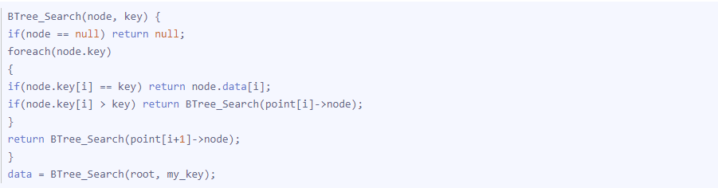

B+Tree及MySQL索引
====
##### 概述
MySQL支持诸多存储引擎，而各种存储引擎对索引的支持可以各不相同，因此MySQL数据库支持多种索引类型，如BTree索引，哈希索引，全文索引等等。
##### 数据结构及算法基础

1. 索引的本质
MySQL官方对索引的定义为：索引是帮助MySQL高效获取数据的数据结构，所以索引是数据结构。
数据库除了维护数据之外，数据库系统还维护着满足特定算法的数据结构，这些数据结构以某种方式指向数据，这就可以在数据结构上实现高级查找算法，这种数据结构，就是索引。
1. B-Tree
目前大部分数据库系统及其文件系统都采用B-Tree或者B+Tree作为索引结构。
B-Tree指的是Balance Tree，也就是平衡树。平衡树是一颗查找树，并且所有叶子节点位于同一层。
B+ Tree 是基于B Tree 和叶子节点顺序访问指针进行实现，它具有B Tree 的平衡性，并且通过顺序访问指针来提高区间查询的性能。
为了描述B-Tree，首先定义一条数据记录为一个二元组[key, data]，key为记录的键值，对于不同数据记录，key是互不相同的；data为数据记录除key外的数据。那么B-Tree是满足下列条件的数据结构：
   * d为大于1的一个正整数，称为B-Tree的度。
   * h为一个正整数，称为B-Tree的高度。
   * 每个非叶子节点由n-1个key和n个指针组成，其中d<=n<=2d。
   * 每个叶子节点最少包含一个key和两个指针，最多包含2d-1个key和2d个指针，叶节点的指针均为null 。
   * 所有叶节点具有相同的深度，等于树高h。
   * key和指针互相间隔，节点两端是指针。
   * 一个节点中的key从左到右非递减排列。
   * 所有节点组成树结构。
   * 每个指针要么为null，要么指向另外一个节点。
   * 如果某个指针在节点node最左边且不为null，则其指向节点的所有key小于v(key1)，其中v(key1)为node的第一个key的值。
   * 如果某个指针在节点node最右边且不为null，则其指向节点的所有key大于v(keym)，其中v(keym)为node的最后一个key的值。
   * 如果某个指针在节点node的左右相邻key分别是keyi和keyi+1且不为null，则其指向节点的所有key小于v(keyi+1)且大于v(keyi)。
* 

由于B-Tree的特性，在B-Tree中按key检索数据的算法非常直观：首先从根节点进行二分查找，如果找到则返回对应节点的data，否则对相应区间的指针指向的节点递归进行查找，直到找到节点或找到null指针，前者查找成功，后者查找失败。B-Tree上查找算法的伪代码如下：

B-Tree有一些性质，一个度为d的B-Tree，设其索引N个key:
   * 其树高h的上限为logd((N+1)/2);
   * 检索一个key，时间复杂度为O(logdN)。
3. B+Tree
B+Tree是B-Tree的变种，MySQL普遍使用B+Tree实现索引结构。
与B-Tree相比，每个节点的指针上限为2d而不是2d+1；内存节点不存储data，只存储key；叶子节点不存储指针。
在 B+ Tree 中，一个节点中的 key 从左到右非递减排列，如果某个指针的左右相邻 key 分别是 keyi 和 keyi+1，且不为 null，则该指针指向节点的所有 key 大于等于 keyi 且小于等于 keyi+1。

由于并不是所有节点都具有相同的域，因此B+Tree中叶节点和内节点一般大小不同，这个B-Tree不同，虽然B-Tree中不同节点存放的key和指针可能数量不一致，但是每个节点的域和上限是一致的，所以在视线中B-Tree往往对每个节点申请同等大小的空间。
进行查找操作时，首先在根节点进行二分查找，找到一个 key 所在的指针，然后递归地在指针所指向的节点进行查找。直到查找到叶子节点，然后在叶子节点上进行二分查找，找出 key 所对应的 data。
插入删除操作会破坏平衡树的平衡性，因此在插入删除操作之后，需要对树进行一个分裂、合并、旋转等操作来维护平衡性。
4. 带有访问顺序的B+Tree
一般在数据库系统或者文件系统中使用的B+Tree结构都在经典的B+Tree的基础上进行了优化，增加顺序访问指针。

在B+Tree的每个叶子节点增加一个指向相邻叶子节点的指针，就形成了带有顺序访问指针的B+Tree，这个优化的目的是为了提高区间访问的性能。
##### 为什么使用B-Tree(B+Tree)
一般来说，索引本身也很大，不可能全部存储在内存中，因此索引往往以索引文件的形式存储在磁盘上。这样的话，索引查找过程中就要产生磁盘I/O消耗，相对于内存存取，I/O存取的消耗要高几个数量级，所以一个数据结构作为索引的优劣最重要的指标就是在查找过程中磁盘I/O操作次数对的渐进复杂度。
1. 主存存取原理
当系统需要读取主存时，则将地址信号放到地址总线上传给主存，主存读到地址信号后，解析信号并定位到指定存储单元，然后将此存储单元数据放到数据总线上，供其它部件读取。
写主存的过程类似，系统将要写入的单元地址和数据分别放在地址总线和数据总线上，主存读取两个总线的内容，做相应的操作。

2. 磁盘存取原理
当需要从磁盘读取数据时，系统会将数据逻辑地址传给磁盘，磁盘的控制电路按照寻址逻辑将逻辑地址翻译成物理地址，即确定要读的数据在哪个磁道，哪个扇区。为了读取这个扇区的数据，需要将磁头放到这个扇区上方，为了实现这一点，磁头需要移动对准相应磁道，这个过程叫做寻道，所耗费时间叫做寻道时间，然后磁盘旋转将目标扇区旋转到磁头下，这个过程耗费的时间叫做旋转时间。

3. 局部性原理和磁盘预读
局部性原理：
当一个数据被用到时，其附近的数据也通常会马上被使用；程序运行期间所需要的数据通常比较集中；由于磁盘顺序读取的效率很高（不需要寻道时间，只需很少的旋转时间），因此对于具有局部性的程序来说，预读可以提高I/O效率。
预读的长度一般为页（page）的整倍数。页是计算机管理存储器的逻辑块，硬件及操作系统往往将主存和磁盘存储区分割为连续的大小相等的块，每个存储块称为一页（在许多操作系统中，页得大小通常为4k），主存和磁盘以页为单位交换数据。当程序要读取的数据不在主存中时，会触发一个缺页异常，此时系统会向磁盘发出读盘信号，磁盘会找到数据的起始位置并向后连续读取一页或几页载入内存中，然后异常返回，程序继续运行。

4. B-/+Tree索引的性能分析
根据B-Tree的定义，可知检索一次最多需要访问h个节点。数据库系统的设计者巧妙的利用磁盘预读原理，将一个节点的大小设为等于一个页，这样每个节点只需要一次I/O就可以完全载入。为了达到这个目的，实现B-Tree还是用如下技巧：
* 每次新建节点时，直接申请一个页的空间，这样就保证一个节点物理上也存储在一个页里，加之计算机分配都是按页对齐的，就实现了一个节点只需要一次I/O。
* B-Tree中一次检索最多需要h-1次I/O(根节点常驻内存)，时间复杂度为O(h) = O(logdN)。一般实际应用中，出度d是非常大的数字，通常超过100，因此h非常小。
综上所述，用B-Tree作为索引结构效率是非常高的。
而红黑树这种结构，h明显要深的多。由于逻辑上很近的节点（父子）物理上可能很远，无法利用局部性，所以红黑树的I/O渐进复杂度也为O(h)，效率明显比B-Tree差很多。
上文还说过，B+Tree更适合外存索引，原因和内节点出度d有关。从上面分析可以看到，d越大索引的性能越好，而出度的上限取决于节点内key和data的大小：
d_{max}=floor(pagesize / (keysize + datasize + pointsize))
floor表示向下取整。由于B+Tree内节点去掉了data域，因此可以拥有更大的出度，拥有更好的性能。

##### MySQL索引介绍
索引是在存储引擎层实现的，而不是在服务器层实现的，所以不同存储引擎具有不同的索引类型和实现。
1. B+Tree 索引
是大多数 MySQL 存储引擎的默认索引类型。
因为不再需要进行全表扫描，只需要对树进行搜索即可，所以查找速度快很多。
因为 B+ Tree 的有序性，所以除了用于查找，还可以用于排序和分组。
可以指定多个列作为索引列，多个索引列共同组成键。
适用于全键值、键值范围和键前缀查找，其中键前缀查找只适用于最左前缀查找。如果不是按照索引列的顺序进行查找，则无法使用索引。
InnoDB 的 B+Tree 索引分为主索引和辅助索引。主索引的叶子节点 data 域记录着完整的数据记录，这种索引方式被称为聚簇索引。因为无法把数据行存放在两个不同的地方，所以一个表只能有一个聚簇索引。

辅助索引的叶子节点的 data 域记录着主键的值，因此在使用辅助索引进行查找时，需要先查找到主键值，然后再到主索引中进行查找。

2. 哈希索引
哈希索引能以 O(1) 时间进行查找，但是失去了有序性：
无法用于排序与分组；
只支持精确查找，无法用于部分查找和范围查找。
InnoDB 存储引擎有一个特殊的功能叫“自适应哈希索引”，当某个索引值被使用的非常频繁时，会在 B+Tree 索引之上再创建一个哈希索引，这样就让 B+Tree 索引具有哈希索引的一些优点，比如快速的哈希查找。
3. 全文索引
MyISAM 存储引擎支持全文索引，用于查找文本中的关键词，而不是直接比较是否相等。
查找条件使用 MATCH AGAINST，而不是普通的 WHERE。
全文索引使用倒排索引实现，它记录着关键词到其所在文档的映射。
InnoDB 存储引擎在 MySQL 5.6.4 版本中也开始支持全文索引。
4. 空间数据索引
MyISAM 存储引擎支持空间数据索引（R-Tree），可以用于地理数据存储。空间数据索引会从所有维度来索引数据，可以有效地使用任意维度来进行组合查询。
必须使用 GIS 相关的函数来维护数据。
