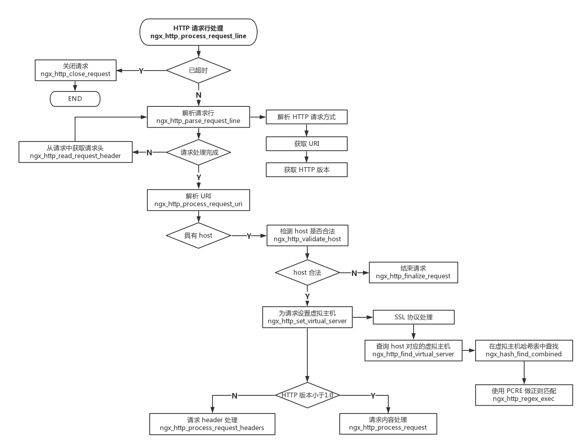
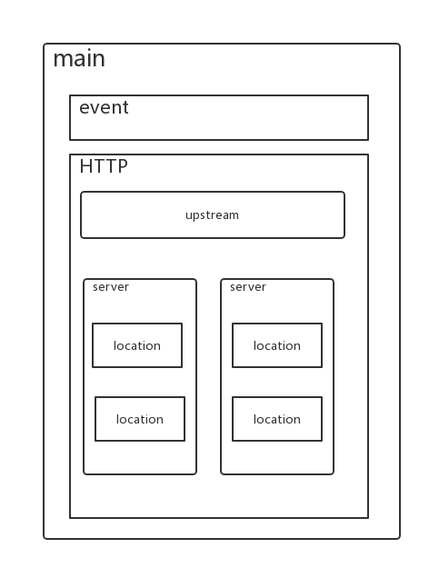
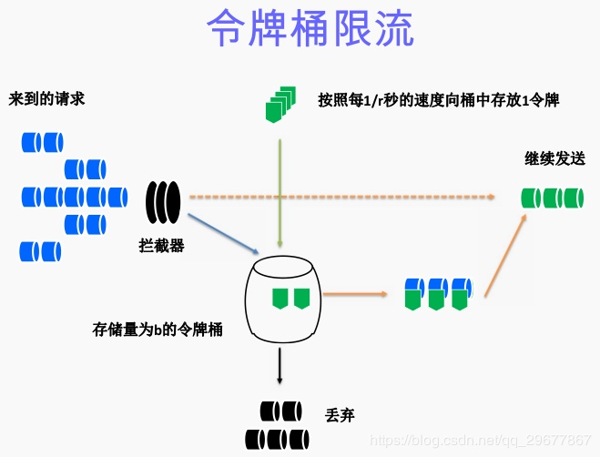

Nginx
====

<!-- TOC -->
- [Nginx](#nginx)
  - [介绍](#介绍)
    - [Nginx功能介绍](#nginx功能介绍)
    - [nginx可以提供的服务](#nginx可以提供的服务)
    - [nginx的优点](#nginx的优点)
    - [nginx应用场合](#nginx应用场合)
    - [nginx全局变量](#nginx全局变量)
    - [web服务器事件处理模型](#web服务器事件处理模型)
        - [select](#select)
        - [poll](#poll)
        - [epoll](#epoll)
        - [nginx -s reload 过程](#nginx--s-reload-过程)
        - [Apache select模型和 nginx epoll 模型对比讲解](#apache-select模型和-nginx-epoll-模型对比讲解)
        - [select/epoll的特点](#selectepoll的特点)
  - [配置](#配置)
    - [配置文件](#配置文件)
    - [main全局配置](#main全局配置)
    - [events模块](#events模块)
    - [http服务器](#http服务器)
        - [HTTP参数之客户端head缓存](#http参数之客户端head缓存)
        - [HTTP参数之FastCGI参数](#http参数之fastcgi参数)
        - [HTTP参数之gzip模块设置](#http参数之gzip模块设置)
    - [nginx 配置虚拟主机](#nginx-配置虚拟主机)
        - [配置虚拟主机流程](#配置虚拟主机流程)
        - [sever模块下location模块的写法](#sever模块下location模块的写法)
    - [其它nginx参数](#其它nginx参数)
        - [访问控制 allow/deny](#访问控制-allowdeny)
        - [列出目录 autoindex](#列出目录-autoindex)
    - [通用配置文件](#通用配置文件)
    - [如何查看是否开启了gzip压缩](#如何查看是否开启了gzip压缩)
  - [日志](#日志)
    - [nginx access日志配置](#nginx-access日志配置)
        - [access_log日志配置](#access_log日志配置)
        - [log_format 定义日志格式](#log_format-定义日志格式)
        - [open_log_file_cache](#open_log_file_cache)
        - [日志中常用的全局变量](#日志中常用的全局变量)
    - [nginx日志调试技巧](#nginx日志调试技巧)
        - [仅记录固定 IP 的错误](#仅记录固定-ip-的错误)
        - [调试 nginx rewrite 规则](#调试-nginx-rewrite-规则)
        - [使用location记录指定URL的日志](#使用location记录指定url的日志)
    - [常用例子](#常用例子)
        - [main格式](#main格式)
        - [json格式](#json格式)
        - [压缩格式](#压缩格式)
        - [upstream格式](#upstream格式)
  - [负载均衡](#负载均衡)
    - [upstream模块解读](#upstream模块解读)
        - [nginx默认支持四种调度算法](#nginx默认支持四种调度算法)
        - [server模块的写法](#server模块的写法)
        - [长连接 keepalive](#长连接-keepalive)
    - [location 模块解读](#location-模块解读)
        - [基本语法：](#基本语法)
    - [proxy_pass 模块解读](#proxy_pass-模块解读)
        - [配置后端服务器接收前端真实IP](#配置后端服务器接收前端真实ip)
        - [proxy_pass相关的优化参数](#proxy_pass相关的优化参数)
    - [健康检查](#健康检查)
    - [一个完整的nginx实例](#一个完整的nginx实例)
  - [限流配置](#限流配置)
    - [限流算法](#限流算法)
        - [令牌桶算法](#令牌桶算法)
        - [漏桶算法](#漏桶算法)
        - [limit_req_zone 参数配置](#limit_req_zone-参数配置)
        - [ngx_http_limit_conn_module 参数配置](#ngx_http_limit_conn_module-参数配置)
<!-- /TOC -->

## 介绍
### Nginx功能介绍
Nginx因为它的稳定性、丰富的模块库、灵活的配置和低系统资源的消耗而闻名．业界一致认为它是Apache2.2＋mod_proxy_balancer的轻量级代替者，不仅是因为响应静态页面的速度非常快，而且它的模块数量达到Apache的近2/3。对proxy和rewrite模块的支持很彻底，还支持mod_fcgi、ssl、vhosts ，适合用来做mongrel clusters的前端HTTP响应。
nginx和Apache一样使用模块化设计，nginx模块包括内置模块和第三方模块，其中内置模块中包含主模块和事件模块。
nginx处理请求逻辑图

### nginx可以提供的服务
* web 服务.
* 负载均衡 （反向代理）
* web cache（web 缓存）
### nginx的优点
* 高并发。静态小文件
* 占用资源少。2万并发、10个线程，内存消耗几百M。
* 功能种类比较多。web,cache,proxy。每一个功能都不是特别强。
* 支持epoll模型，使得nginx可以支持高并发。
* nginx 配合动态服务和Apache有区别。（FASTCGI 接口）
* 利用nginx可以对IP限速，可以限制连接数。
* 配置简单，更灵活。
### nginx应用场合
* 静态服务器。（图片，视频服务）另一个lighttpd。并发几万，html，js，css，flv，jpg，gif等。
* 动态服务，nginx——fastcgi 的方式运行PHP，jsp。（PHP并发在500-1500，MySQL 并发在300-1500）。
* 反向代理，负载均衡。日pv2000W以下，都可以直接用nginx做代理。
* 缓存服务。类似 SQUID,VARNISH。
### nginx全局变量
```properties
$args：这个变量等于请求行中的参数，同$query_string。
$is_args: 如果已经设置$args，则该变量的值为"?"，否则为""。
$content_length： 请求头中的Content-length字段。
$content_type： 请求头中的Content-Type字段。
$document_uri： 与$uri相同。
$document_root： 当前请求在root指令中指定的值。
$host： 请求主机头字段，否则为服务器名称。
$http_user_agent： 客户端agent信息。
$http_cookie： 客户端cookie信息。
$limit_rate： 这个变量可以限制连接速率。
$request_method： 客户端请求的动作，通常为GET或POST。
$remote_addr： 客户端的IP地址。
$remote_port： 客户端的端口。
$remote_user： 已经经过Auth Basic Module验证的用户名。
$request_body_file`: 客户端请求主体的临时文件名。
$request_uri: 请求的URI，带参数
$request_filename： 当前请求的文件路径，由root或alias指令与URI请求生成。
$scheme： 所用的协议，比如http或者是https，比如rewrite ^(.+)$ $scheme://example.com$1 redirect;。
$server_protocol： 请求使用的协议，通常是HTTP/1.0或HTTP/1.1。
$server_addr： 服务器地址，在完成一次系统调用后可以确定这个值。
$server_name： 服务器名称。
$server_port： 请求到达服务器的端口号。
$request_uri： 包含请求参数的原始URI，不包含主机名，如：/foo/bar.php?arg=baz，它无法修改。
$uri： 不带请求参数的当前URI，$uri不包含主机名，如/foo/bar.html可能和最初的值有不同，比如经过重定向之类的。它可以通过内部重定向，或者使用index指令进行修改。不包括协议和主机名，例如/foo/bar.html。
```

### web服务器事件处理模型
##### select
select最早于1983年出现在4.2BSD中，它通过一个select()系统调用来监视多个文件描述符的数组，当select()返回后，该数组中就绪的文件描述符便会被内核修改标志位，使得进程可以获得这些文件描述符从而进行后续的读写操作。
select目前几乎在所有的平台上支持，其良好跨平台支持也是它的一个优点，事实上从现在看来，这也是它所剩不多的优点之一。
select的一个缺点在于单个进程能够监视的文件描述符的数量存在最大限制，在Linux上一般为1024，不过可以通过修改宏定义甚至重新编译内核的方式提升这一限制。
另外，select()所维护的存储大量文件描述符的数据结构，随着文件描述符数量的增大，其复制的开销也线性增长。同时，由于网络响应时间的延迟使得大量TCP连接处于非活跃状态，但调用select()会对所有socket进行一次线性扫描，所以这也浪费了一定的开销。

##### poll
poll在1986年诞生于System V Release 3，它和select在本质上没有多大差别，但是poll没有最大文件描述符数量的限制。
poll和select同样存在一个缺点就是，包含大量文件描述符的数组被整体复制于用户态和内核的地址空间之间，而不论这些文件描述符是否就绪，它的开销随着文件描述符数量的增加而线性增大。
另外，select()和poll()将就绪的文件描述符告诉进程后，如果进程没有对其进行IO操作，那么下次调用select()和poll()的时候将再次报告这些文件描述符，所以它们一般不会丢失就绪的消息，这种方式称为水平触发（Level Triggered）。

##### epoll
直到Linux2.6才出现了由内核直接支持的实现方法，那就是epoll，它几乎具备了之前所说的一切优点，被公认为Linux2.6下性能最好的多路I/O就绪通知方法。
epoll可以同时支持水平触发和边缘触发（Edge Triggered，只告诉进程哪些文件描述符刚刚变为就绪状态，它只说一遍，如果我们没有采取行动，那么它将不会再次告知，这种方式称为边缘触发），理论上边缘触发的性能要更高一些，但是代码实现相当复杂。
epoll同样只告知那些就绪的文件描述符，而且当我们调用epoll_wait()获得就绪文件描述符时，返回的不是实际的描述符，而是一个代表就绪描述符数量的值，你只需要去epoll指定的一个数组中依次取得相应数量的文件描述符即可，这里也使用了内存映射（mmap）技术，这样便彻底省掉了这些文件描述符在系统调用时复制的开销。
另一个本质的改进在于epoll采用基于事件的就绪通知方式。在select/poll中，进程只有在调用一定的方法后，内核才对所有监视的文件描述符进行扫描，而epoll事先通过epoll_ctl()来注册一个文件描述符，一旦基于某个文件描述符就绪时，内核会采用类似callback的回调机制，迅速激活这个文件描述符，当进程调用epoll_wait()时便得到通知。

##### nginx -s reload 过程
nginx主进程读取配置文件，如果发现配置文件变更，会创建一个新的主进程，然后同时旧的进程，及旧的子进程关闭，旧进程会拒绝新的连接，服务到自己的连接结束，然后关闭。

##### Apache select模型和 nginx epoll 模型对比讲解
Nginx的高并发得益于其采用了epoll模型，与传统的服务器程序架构不同，epoll是linux内核2.6以后才出现的。下面通过比较Apache和Nginx工作原理来比较。

传统Apache都是多进程或者多线程来工作，假设是多进程工作（prefork），apache会先生成几个进程，类似进程池的工作原理，只不过这里的进程池会随着请求数目的增加而增加。对于每一个连接，apache都是在一个进程内处理完毕。具体是 recv（），以及根据 URI 去进行磁盘I/O来寻找文件，还有 send（）都是阻塞的。其实说白了都是 apche 对于套接字的I/O，读或者写，但是读或者写都是阻塞的，阻塞意味着进程就得挂起进入sleep状态，那么一旦连接数很多，Apache必然要生成更多的进程来响应请求，一旦进程多了，CPU对于进程的切换就频繁了，很耗资源和时间，所以就导致apache性能下降了，说白了就是处理不过来这么多进程了。其实仔细想想，如果对于进程每个请求都没有阻塞，那么效率肯定会提高很多。

Nginx采用epoll模型，异步非阻塞。对于Nginx来说，把一个完整的连接请求处理都划分成了事件，一个一个的事件。比如accept（）， recv（），磁盘I/O，send（）等，每部分都有相应的模块去处理，一个完整的请求可能是由几百个模块去处理。真正核心的就是事件收集和分发模块，这就是管理所有模块的核心。只有核心模块的调度才能让对应的模块占用CPU资源，从而处理请求。拿一个HTTP请求来说，首先在事件收集分发模块注册感兴趣的监听事件，注册好之后不阻塞直接返回，接下来就不需要再管了，等待有连接来了内核会通知你(epoll的轮询会告诉进程)，cpu就可以处理其他事情去了。一旦有请求来，那么对整个请求分配相应的上下文（其实已经预先分配好），这时候再注册新的感兴趣的事件(read函数)，同样客户端数据来了内核会自动通知进程可以去读数据了，读了数据之后就是解析，解析完后去磁盘找资源（I/O），一旦I/O完成会通知进程，进程开始给客户端发回数据send()，这时候也不是阻塞的，调用后就等内核发回通知发送的结果就行。整个下来把一个请求分成了很多个阶段，每个阶段都到很多模块去注册，然后处理，都是异步非阻塞。异步这里指的就是做一个事情，不需要等返回结果，做好了会自动通知你。

##### select/epoll的特点

select的特点：select 选择句柄的时候，是遍历所有句柄，也就是说句柄有事件响应时，select需要遍历所有句柄才能获取到哪些句柄有事件通知，因此效率是非常低。但是如果连接很少的情况下， select和epoll的LT触发模式相比， 性能上差别不大。
这里要多说一句，select支持的句柄数是有限制的， 同时只支持1024个，这个是句柄集合限制的，如果超过这个限制，很可能导致溢出，而且非常不容易发现问题， 当然可以通过修改linux的socket内核调整这个参数。
epoll的特点：epoll对于句柄事件的选择不是遍历的，是事件响应的，就是句柄上事件来就马上选择出来，不需要遍历整个句柄链表，因此效率非常高，内核将句柄用红黑树保存的。
对于epoll而言还有ET和LT的区别，LT表示水平触发，ET表示边缘触发，两者在性能以及代码实现上差别也是非常大的。

不管是Nginx还是Squid这种反向代理，其网络模式都是事件驱动。事件驱动其实是很老的技术，早期的select、poll都是如此。后来基于内核通知的更高级事件机制出现，如libevent里的epoll，使事件驱动性能得以提高。事件驱动的本质还是IO事件，应用程序在多个IO句柄间快速切换，实现所谓的异步IO。事件驱动服务器，最适合做的就是这种IO密集型工作，如反向代理，它在客户端与WEB服务器之间起一个数据中转作用，纯粹是IO操作，自身并不涉及到复杂计算。反向代理用事件驱动来做，显然更好，一个工作进程就可以run了，没有进程、线程管理的开销，CPU、内存消耗都小。

所以Nginx、Squid都是这样做的。当然，Nginx也可以是多进程 + 事件驱动的模式，几个进程跑libevent，不需要Apache那样动辄数百的进程数。Nginx处理静态文件效果也很好，那是因为静态文件本身也是磁盘IO操作，处理过程一样。至于说多少万的并发连接，这个毫无意义。随手写个网络程序都能处理几万的并发，但如果大部分客户端阻塞在那里，就没什么价值。

再看看Apache或者Resin这类应用服务器，之所以称他们为应用服务器，是因为他们真的要跑具体的业务应用，如科学计算、图形图像、数据库读写等。它们很可能是CPU密集型的服务，事件驱动并不合适。例如一个计算耗时2秒，那么这2秒就是完全阻塞的，什么event都没用。想想MySQL如果改成事件驱动会怎么样，一个大型的join或sort就会阻塞住所有客户端。这个时候多进程或线程就体现出优势，每个进程各干各的事，互不阻塞和干扰。当然，现代CPU越来越快，单个计算阻塞的时间可能很小，但只要有阻塞，事件编程就毫无优势。所以进程、线程这类技术，并不会消失，而是与事件机制相辅相成，长期存在。

总言之，事件驱动适合于IO密集型服务，多进程或线程适合于CPU密集型服务，它们各有各的优势，并不存在谁取代谁的倾向。

## 配置

### 配置文件
nginx配置文件主要分为四个部分：
```properties
main{ #（全局设置）
    http{ #服务器
        upstream{} #（负载均衡服务器设置：主要用于负载均衡和设置一系列的后端服务器）
        server{ #（主机设置：主要用于指定主机和端口）
            location{} #（URL匹配特点位置的设置）
        }
    }
}   
```
server继承main，location继承server，upstream即不会继承其他设置也不会被继承。


### main全局配置
nginx在运行时与具体业务功能（比如http服务或者email服务代理）无关的一些参数，比如工作进程数，运行的身份等。
```properties
user  www www;
worker_processes 4;
worker_cpu_affinity 0001 0010 0100 1000;
error_log  /var/logs/nginx_error.log  crit;
pid        /usr/local/webserver/nginx/nginx.pid;
worker_rlimit_nofile 65535;
```
* user www www;: 指定nginx进程使用什么用户启动
worker_processes 4; : 指定启动多少进程来处理请求，一般情况下设置成CPU的核数，如果开启了ssl和gzip更应该设置成与逻辑CPU数量一样甚至为2倍，可以减少I/O操作。使用grep ^processor /proc/cpuinfo | wc -l查看CPU核数。
* worker_cpu_affinity 0001 0010 0100 1000;: 在高并发情况下，通过设置将CPU和具体的进程绑定来降低由于多核CPU切换造成的寄存器等现场重建带来的性能损耗。如worker_cpu_affinity 0001 0010 0100 1000; （四核）。
* error_log /var/logs/nginx_error.log crit;: error_log是个主模块指令，用来定义全局错误日志文件。日志输出级别有debug、info、notice、warn、error、crit可供选择，其中，debug输出日志最为最详细，而crit输出日志最少。
* pid /usr/local/webserver/nginx/nginx.pid;: 指定进程pid文件的位置。
* worker_rlimit_nofile 65535;: 用于指定一个nginx进程可以打开的最多文件描述符数目，这里是65535，需要使用命令“ulimit -n 65535”来设置。

### events模块
```properties
events{
  use epoll;
  worker_connections      65536;
}
```
* use epoll;use是个事件模块指令，用来指定Nginx的工作模式。Nginx支持的工作模式有select、poll、kqueue、epoll、rtsig和/dev/poll。其中select和poll都是标准的工作模式，kqueue和epoll是高效的工作模式，不同的是epoll用在Linux平台上，而kqueue用在BSD系统中。对于Linux系统，epoll工作模式是首选。在操作系统不支持这些高效模型时才使用select。
* worker_connections 65536;每一个worker进程能并发处理（发起）的最大连接数（包含与客户端或后端被代理服务器间等所有连接数）。nginx作为反向代理服务器，计算公式 最大连接数 = worker_processes * worker_connections/4，所以这里客户端最大连接数是65536，这个可以增到到8192都没关系，看情况而定，但不能超过后面的worker_rlimit_nofile。当nginx作为http服务器时，计算公式里面是除以2。进程的最大连接数受Linux系统进程的最大打开文件数限制，在执行操作系统命令ulimit -n 65536后worker_connections的设置才能生效。

### http服务器
```properties
http{
  include       mime.types;
  default_type  application/octet-stream;
  #charset  gb2312;
  }
```
* include是个主模块指令，实现对配置文件所包含的文件的设定，可以减少主配置文件的复杂度。类似于Apache中的include方法。
* default_type属于HTTP核心模块指令，这里设定默认类型为二进制流，也就是当文件类型未定义时使用这种方式，例如在没有配置PHP环境时，Nginx是不予解析的，此时，用浏览器访问PHP文件就会出现下载窗口。
* charset gb2312; 指定客户端编码格式。
  
##### HTTP参数之客户端head缓存
```properties
server_names_hash_bucket_size 128;
client_header_buffer_size 32k; 
large_client_header_buffers 4 128k; 
client_max_body_size 10m; 
client_body_buffer_size 128k; 
sendfile on ; 
tcp_nopush on;
tcp_nodelay on;
keepalive_timeout 65 : 
client_body_timeout 60s;
send_timeout 60s;
```
* server_names_hash_bucket_size 128;: 服务器名字的hash表大小。
* client_header_buffer_size 32k;：用来指定来自客户端请求头的header buffer 大小。对于大多数请求，1K的缓存已经足够了，如果自定义了消息头或有更大的cookie，可以增大缓存区大小。
* large_client_header_buffers 4 128k;：用来指定客户端请求中较大的消息头的缓存最大数量和大小，4为个数，128k为大小，最大缓存为4个128KB。
* client_max_body_size 8m; : 客户端请求的最大的单个文件字节数。
* client_max_body_size 10m; : 允许客户端请求的最大单文件字节数。如果有上传较大文件，请设置它的限制值。
* client_body_buffer_size 128k;: 缓冲区代理缓冲用户端请求的最大字节数。
* sendfile on ; : 开启高效文件传输模式，sendfile指令指定nginx是否调用sendfile函数来输出文件，减少用户空间到内核空间的上下文切换。对于普通应用设为 on，如果用来进行下载等应用磁盘IO重负载应用，可设置为off，以平衡磁盘与网络I/O处理速度，降低系统的负载。开启tcp_nopush on; 和tcp_nodelay on; 防止网络阻塞。
* keepalive_timeout 65 : : 长连接超时时间，单位是秒，这个参数很敏感，涉及浏览器的种类、后端服务器的超时设置、操作系统的设置，可以另外起一片文章了。长连接请求大量小文件的时候，可以减少重建连接的开销，但假如有大文件上传，65s内没上传完成会导致失败。如果设置时间过长，用户又多，长时间保持连接会占用大量资源。
* client_body_timeout 60s; : 用于设置客户端请求主体读取超时时间，默认是60s。如果超过这个时间，客户端还没有发送任何数据，nginx将返回Request time out(408)错误。
* send_timeout : : 用于指定响应客户端的超时时间。这个超时仅限于两个连接活动之间的时间，如果超过这个时间，客户端没有任何活动，Nginx将会关闭连接。
  
##### HTTP参数之FastCGI参数
FastCGI相关参数是为了改善网站的性能：减少资源占用，提高访问速度。下面参数看字面意思都能理解。
```properties
fastcgi_connect_timeout 300;  
fastcgi_send_timeout 300;  
fastcgi_read_timeout 300;  
fastcgi_buffer_size 64k;  
fastcgi_buffers 4 64k;  
fastcgi_busy_buffers_size 128k;  
fastcgi_temp_file_write_size 128k;  
fastcgi_cache TEST;  
fastcgi_cache_path /usr/local/nginx/fastcgi_cache levels=1:2 keys_zone=TEST:10m inactive=5m;  
fastcgi_cache_valid 200 302 1h;  
fastcgi_cache_valid 301 1d;  
fastcgi_cache_valid any 1m; 
```
* fastcgi_connect_timeout 300; 指定连接到后端FastCGI的超时时间。
* fastcgi_send_timeout 300;指定向FastCGI传送请求的超时时间，这个值是已经完成两次握手后向FastCGI传送请求的超时时间。
* fastcgi_read_timeout 300;指定接收FastCGI应答的超时时间，这个值是已经完成两次握手后接收FastCGI应答的超时时间。
* fastcgi_buffer_size 64k; 用于指定读取FastCGI应答第一部分需要多大的缓冲区，这个值表示将使用1个64KB的缓冲区读取应答的第一部分（应答头），可以设置为fastcgi_buffers选项指定的缓冲区大小。
* fastcgi_buffers 4 64k; 指定本地需要用多少和多大的缓冲区来缓冲FastCGI的应答请求。如果一个PHP脚本所产生的页面大小为256KB，那么会为其分配4个64KB的缓冲区来缓存；如果页面大小大于256KB，那么大于256KB的部分会缓存到fastcgi_temp指定的路径中，但是这并不是好方法，因为内存中的数据处理速度要快于硬盘。一般这个值应该为站点中PHP脚本所产生的页面大小的中间值，如果站点大部分脚本所产生的页面大小为256KB，那么可以把这个值设置为“16 16k”、“4 64k”等。
* fastcgi_busy_buffers_size 128k; 默认值是fastcgi_buffers的两倍。
* fastcgi_temp_file_write_size 128k; 表示在写入缓存文件时使用多大的数据块，默认值是fastcgi_buffers的两倍。
* fastcgi_cache TEST; 表示开启FastCGI缓存并为其指定一个名称。开启缓存非常有用，可以有效降低CPU的负载，并且防止502错误的发生。但是开启缓存也会引起很多问题，要视具体情况而定。
* fastcgi_cache_path /usr/local/nginx/fastcgi_cache levels=1:2 keys_zone=TEST:10m inactive=5m; FastCGI缓存指定一个文件路径、目录结构等级、关键字区域存储时间和非活动删除时间。
* fastcgi_cache_valid 200 302 1h; 用来指定应答代码的缓存时间。实例中的值表示将200和302应答缓存一个小时，将301应答缓存1天，其他应答均缓存1分钟

##### HTTP参数之gzip模块设置
```properties
gzip on;
gzip_min_length 1k;
gzip_buffers    4 16k;
gzip_http_version 1.1;
gzip_comp_level 6;
gzip_types text/html text/plain text/css text/javascript application/json application/javascript application/x-javascript application/xml;
gzip_vary on;
```
* gzip on;开启gzip压缩输出
* gzip_min_length 1k; 最小压缩文件大小，页面字节数从header头的Content-Length中获取。默认值为0，不管多大页面都压缩，建议设置成大于1K的字节数，小于1K可能会越压越大。
* gzip_buffers 4 16k; 压缩缓冲区，表示申请四个16K的内存作为压缩结果流缓存，默认是申请与原始数据大小相同的内存空间来存储gzip压缩结果。
* gzip_http_version 1.1; 用于设置识别HTTP协议版本，默认是1.1，目前主流浏览器都已成指出。（默认1.1，前端如果是squid2.5请使用1.0）
* gzip_comp_level 6; 压缩等级，1压缩比最小，处理速度最快，9压缩比最大，传输速度快，但是消耗CPU资源。
* gzip_types text/plain application/x-javascript text/css application/xml;压缩类型，默认就已经包含text/html，所以下面就不用再写了，写上去也不会有问题，但是会有一个warn。
* gzip_vary on; 和http头有关系，会在响应头加个 Vary: Accept-Encoding ，可以让前端的缓存服务器缓存经过gzip压缩的页面，例如，用Squid缓存经过Nginx压缩的数据。
* gzip_proxied any; Nginx作为反向代理的时候启用，决定开启或者关闭后端服务器返回的结果是否压缩，匹配的前提是后端服务器必须要返回包含”Via”的 header头。
* limit_zone crawler $binary_remote_addr 10m; 开启限制IP连接数的时候需要使用
  
### nginx 配置虚拟主机
##### 配置虚拟主机流程
1. 复制一段完整的server标签段，到结尾。注意：要放在http的结束大括号前，也就是server标签段放入http标签。
2. 更改server_name 及对应网页的root根目录。
3. 检查配置文件语法，平滑重启服务。
4. 创建server_name 对应网页的根目录，并且建立测试文件，如果没有index首页会出现403错误。
5. 对客户端server_name 的主机做host 解析或DNS配置。并检查（ping）。
6. 浏览器访问，或者在Linux客户端做host解析，用wget或curl 访问。

http服务上支持若干虚拟主机。每个虚拟主机一个对应的server配置项，配置项里面包含该虚拟主机相关的配置。在提供mail服务的代理时，也可以建立若干server。每个server通过监听地址或端口来区分。
```properties
server{
    listen 80 default;
    server_name _;
    index index.html index.htm index.php;
    root /data/htdocs/www;
    #server_name_in_redirect off;
    
    location ~ .*\.(php|php5)?${
      #fastcgi_pass  unix:/tmp/php-cgi.sock;
      fastcgi_pass  127.0.0.1:9000;
      fastcgi_index index.php;
      include fcgi.conf;
    }
    
    location ~ .*\.(gif|jpg|jpeg|png|bmp|swf)${
      expires      30d;
    }
    
    location ~ .*\.(js|css)?${
      expires      1h;
    }
  }
```
* listen 80; 监听端口，默认80，小于1024的要以root启动。可以为listen *:80、listen 127.0.0.1:80等形式。
* server_name blog.biglittleant.cn; 服务器名，如localhost、www.example.com，可以通过正则匹配。
* root /var/www/html 定义服务器的默认网站根目录位置。如果locationURL匹配的是子目录或文件，root没什么作用，一般放在server指令里面或/下。
* index index.jsp index.html index.htm 定义路径下默认访问的文件名，一般跟着root放。
  
##### sever模块下location模块的写法
```properties
proxy_pass http://backend
```
请求转向backend定义的服务器列表，即反向代理，对应upstream负载均衡器。也可以proxy_pass http://ip:port。
```properties
proxy_redirect off;
proxy_set_header Host $host;
proxy_set_header X-Real-IP $remote_addr;
proxy_set_header X-Forwarded-For $proxy_add_x_forwarded_for;
```

### 其它nginx参数
##### 访问控制 allow/deny
Nginx 的访问控制模块默认就会安装，而且写法也非常简单，可以分别有多个allow,deny，允许或禁止某个ip或ip段访问，依次满足任何一个规则就停止往下匹配。如：
```properties
location /nginx-status {
  stub_status on;
  access_log off;
#  auth_basic   "NginxStatus";
#  auth_basic_user_file   /usr/local/nginx-1.6/htpasswd;
  allow 192.168.10.100;
  allow 172.29.73.0/24;
  deny all;
}
```
我们也常用 httpd-devel 工具的 htpasswd 来为访问的路径设置登录密码：
```properties
# htpasswd -c htpasswd admin
New passwd:
Re-type new password:
Adding password for user admin
# htpasswd htpasswd admin    //修改admin密码
# htpasswd htpasswd sean    //多添加一个认证用户
```
这样就生成了默认使用CRYPT加密的密码文件。打开上面nginx-status的两行注释，重启nginx生效。

##### 列出目录 autoindex
Nginx默认是不允许列出整个目录的。如需此功能，打开nginx.conf文件，在location，server 或 http段中加入如下参数：
```properties
location /images {
  root   /var/www/nginx-default/images;
  autoindex on;
  autoindex_exact_size off;
  autoindex_localtime on;
  }
```
* autoindex on;运行列出目录内容。另外两个参数最好也加上去。
* autoindex_exact_size off; 默认为on，显示出文件的确切大小，单位是bytes。改为off后，显示出文件的大概大小，单位是kB或者MB或者GB。
* autoindex_localtime on; 默认为off，显示的文件时间为GMT时间。改为on后，显示的文件时间为文件的服务器时间。
### 通用配置文件
```properties
user  www www;
worker_processes  2;
error_log  logs/error.log;
#error_log  logs/error.log  notice;
#error_log  logs/error.log  info;
pid        logs/nginx.pid;
events {
    use epoll;
    worker_connections  2048;
}
http {
    include       mime.types;
    default_type  application/octet-stream;
    #log_format  main  '$remote_addr - $remote_user [$time_local] "$request" '
    #                  '$status $body_bytes_sent "$http_referer" '
    #                  '"$http_user_agent" "$http_x_forwarded_for"';
    #access_log  logs/access.log  main;
    sendfile        on;
    # tcp_nopush     on;
    keepalive_timeout  65;
  # gzip压缩功能设置
    gzip on;
    gzip_min_length 1k;
    gzip_buffers    4 16k;
    gzip_http_version 1.1;
    gzip_comp_level 6;
    gzip_types text/html text/plain text/css text/javascript application/json application/javascript application/x-javascript application/xml;
    gzip_vary on;
  
  # http_proxy 设置
    client_max_body_size   10m;
    client_body_buffer_size   128k;
    proxy_connect_timeout   75;
    proxy_send_timeout   75;
    proxy_read_timeout   75;
    proxy_buffer_size   4k;
    proxy_buffers   4 32k;
    proxy_busy_buffers_size   64k;
    proxy_temp_file_write_size  64k;
    proxy_temp_path   /usr/local/nginx/proxy_temp 1 2;
  # 设定负载均衡后台服务器列表 
    upstream  backend  { 
              #ip_hash; 
              server   192.168.10.100:8080 max_fails=2 fail_timeout=30s ;  
              server   192.168.10.101:8080 max_fails=2 fail_timeout=30s ;  
    }
  # 很重要的虚拟主机配置，多个虚拟机可以复制修改此部分
    server {
        listen       80;
        server_name  test.example.com;
        root   /apps/oaapp;
        charset utf-8;
        access_log  logs/host.access.log  main;
        #对 / 所有做负载均衡+反向代理
        location / {
            root   /apps/oaapp;
            index  index.php index.html index.htm;
            proxy_pass        http://backend;  
            proxy_redirect off;
            # 后端的Web服务器可以通过X-Forwarded-For获取用户真实IP
            proxy_set_header  Host  $host;
            proxy_set_header  X-Real-IP  $remote_addr;  
            proxy_set_header  X-Forwarded-For  $proxy_add_x_forwarded_for;
            proxy_next_upstream error timeout invalid_header http_500 http_502 http_503 http_504;
        }
        
        #静态文件，nginx自己处理，不去backend请求后端的服务
        location  ~* /download/ {  
            root /data/app/nginx/downloads;  
        }
        
        location ~ .*\.(gif|jpg|jpeg|bmp|png|ico|txt|js|css)$ {   
            root /data/app/nginx/images;   
            expires      7d; 
        }
        
        location /nginx_status {
            stub_status on;
            access_log off;
            allow 192.168.10.0/24;
            deny all;
        }
        
        location ~ ^/(WEB-INF)/ {   
            deny all;   
        }
        
        #error_page  404              /404.html;
        # redirect server error pages to the static page /50x.html
        #
        error_page   500 502 503 504  /50x.html;
        
        location = /50x.html {
            root   html;
        }
    }
}
```
### 如何查看是否开启了gzip压缩
如果response header中包含Content-Encoding:gzip则表示开启gzip压缩。
```properties
Connection:keep-alive
Content-Encoding:gzip
Content-Type:text/html
Date:Wed, 29 Mar 2017 10:55:54 GMT
ETag:W/"58db92af-331a6"
Last-Modified:Wed, 29 Mar 2017 10:55:43 GMT
Server:nginx/1.10.3
Transfer-Encoding:chunked
Vary:Accept-Encoding
```
## 日志

### nginx access日志配置
##### access_log日志配置
access_log用来定义日志级别，日志位置。语法如下：
日志级别： debug > info > notice > warn > error > crit > alert > emerg
>语法格式: access_log path [format [buffer=size] [gzip[=level]] [flush=time] [if=condition]];
access_log off;
默认值 : access_log logs/access.log combined;
作用域 : http, server, location, if in location, limit_except

实例一：
```properties
access_log /var/logs/nginx-access.log compression buffer=32k;
```
##### log_format 定义日志格式
>语法格式: log_format name [escape=default|json] string …;
默认值 : log_format combined “…”;
作用域 : http

实例一：
```properties
log_format compression '$remote_addr - $remote_user [$time_local] '
                       '"$request" $status $bytes_sent '
                       '"$http_referer" "$http_user_agent" "$gzip_ratio"';
access_log /var/logs/nginx-access.log compression buffer=32k;
```
##### open_log_file_cache
使用open_log_file_cache来设置日志文件缓存(默认是off)。
* max:设置缓存中的最大文件描述符数量，如果缓存被占满，采用LRU算法将描述符关闭。
* inactive:设置存活时间，默认是10s
* min_uses:设置在inactive时间段内，日志文件最少使用多少次后，该日志文件描述符记入缓存中，默认是1次
* valid:设置检查频率，默认60s
* off：禁用缓存
>语法格式: open_log_file_cache max=N [inactive=time] [min_uses=N] [valid=time];
open_log_file_cache off;
默认值: open_log_file_cache off;
作用域: http, server, location

实例一
```properties
open_log_file_cache max=1000 inactive=20s valid=1m min_uses=2;
```
##### 日志中常用的全局变量
```properties
$remote_addr, $http_x_forwarded_for 记录客户端IP地址
$remote_user记录客户端用户名称
$request记录请求的URL和HTTP协议(GET,POST,DEL,等)
$status记录请求状态
$body_bytes_sent发送给客户端的字节数，不包括响应头的大小； 该变量与Apache模块mod_log_config里的“%B”参数兼容。
$bytes_sent发送给客户端的总字节数。
$connection连接的序列号。
$connection_requests 当前通过一个连接获得的请求数量。
$msec 日志写入时间。单位为秒，精度是毫秒。
$pipe如果请求是通过HTTP流水线(pipelined)发送，pipe值为“p”，否则为“.”。
$http_referer 记录从哪个页面链接访问过来的
$http_user_agent记录客户端浏览器相关信息
$request_length请求的长度（包括请求行，请求头和请求正文）。
$request_time 请求处理时间，单位为秒，精度毫秒； 从读入客户端的第一个字节开始，直到把最后一个字符发送给客户端后进行日志写入为止。
$time_iso8601 ISO8601标准格式下的本地时间。
$time_local通用日志格式下的本地时间。
```
### nginx日志调试技巧
##### 仅记录固定 IP 的错误
当你设置日志级别成 debug，如果你在调试一个在线的高流量网站的话，你的错误日志可能会记录每个请求的很多消息，这样会变得毫无意义。
在events{...}中配置如下内容，可以使 Nginx 记录仅仅来自于你的 IP 的错误日志。
```properties
events {
        debug_connection 1.2.3.4;
}
```
##### 调试 nginx rewrite 规则
调试rewrite规则时，如果规则写错只会看见一个404页面，可以在配置文件中开启nginx rewrite日志，进行调试。
```properties
server {
        error_log    /var/logs/nginx/example.com.error.log;
        rewrite_log on;
}
```
rewrite_log on; 开启后，它将发送所有的 rewrite 相关的日志信息到 error_log 文件中，使用 [notice] 级别。随后就可以在error_log 查看rewrite信息了。

##### 使用location记录指定URL的日志
```properties
server {
        error_log    /var/logs/nginx/example.com.error.log;
        location /static/ {
        error_log /var/logs/nginx/static-error.log debug; 
    }         
}
```
配置以上配置后，/static/ 相关的日志会被单独记录在static-error.log文件中。

nginx日志共三个参数
1. access_log: 定义日志的路径及格式。
1. log_format: 定义日志的模板。
1. open_log_file_cache: 定义日志文件缓存。

proxy_set_header X-Forwarded-For ：如果后端Web服务器上的程序需要获取用户IP，从该Header头获取。proxy_set_header X-Forwarded-For $remote_addr;

### 常用例子
##### main格式
```properties
log_format  main  '$remote_addr - $remote_user [$time_local] "$request" '
                      '$status $body_bytes_sent "$http_referer" '
                      '"$http_user_agent" "$http_x_forwarded_for"'
                       '$upstream_addr $upstream_response_time $request_time ';
access_log  logs/access.log  main;
```
##### json格式
```properties
log_format logstash_json '{"@timestamp":"$time_iso8601",'
       '"host": "$server_addr",'
       '"client": "$remote_addr",'
       '"size": $body_bytes_sent,'
       '"responsetime": $request_time,'
       '"domain": "$host",'
       '"url":"$request_uri",'
       '"referer": "$http_referer",'
       '"agent": "$http_user_agent",'
       '"status":"$status",'
       '"x_forwarded_for":"$http_x_forwarded_for"}';
```
坑点：
使用$uri 可以在nginx对URL进行更改或重写，但是用于日志输出可以使用$request_uri代替，如无特殊业务需求，完全可以替换。

##### 压缩格式
日志中增加了压缩的信息。
```properties
http {
    log_format compression '$remote_addr - $remote_user [$time_local] '
                           '"$request" $status $body_bytes_sent '
                           '"$http_referer" "$http_user_agent" "$gzip_ratio"';
    server {
        gzip on;
        access_log /spool/logs/nginx-access.log compression;
        ...
    }
}
```
##### upstream格式
增加upstream消耗的时间。
```properties
http {
    log_format upstream_time '$remote_addr - $remote_user [$time_local] '
                             '"$request" $status $body_bytes_sent '
                             '"$http_referer" "$http_user_agent"'
                             'rt=$request_time uct="$upstream_connect_time" uht="$upstream_header_time" urt="$upstream_response_time"';

    server {
        access_log /spool/logs/nginx-access.log upstream_time;
        ...
    }
}
```
## 负载均衡

使用nginx做负载均衡的两大模块：
* upstream 定义负载节点池。
* location 模块 进行URL匹配。
* proxy模块 发送请求给upstream定义的节点池。

### upstream模块解读
nginx 的负载均衡功能依赖于 ngx_http_upstream_module模块，所支持的代理方式有 proxy_pass(一般用于反向代理),fastcgi_pass(一般用于和动态程序交互),memcached_pass,proxy_next_upstream,fastcgi_next_pass,memcached_next_pass 。

upstream 模块应该放于http{}标签内。

模块写法：
```properties
upstream backend {
    ip_hash; 
    server backend1.example.com       weight=5;
    server backend2.example.com:8080;
    server backup1.example.com:8080   backup;
    server backup2.example.com:8080   backup;
}
```
实例一：
```properties
upstream dynamic {
    zone upstream_dynamic 64k;

    server backend1.example.com      weight=5;
    server backend2.example.com:8080 fail_timeout=5s slow_start=30s;
    server 192.0.2.1                 max_fails=3;
    server backend3.example.com      resolve;

    server backup1.example.com:8080  backup;
    server backup2.example.com:8080  backup;
}
```
##### nginx默认支持四种调度算法
* 轮询(rr),每个请求按时间顺序逐一分配到不同的后端服务器，如果后端服务器故障，故障系统自动清除，使用户访问不受影响。
* 轮询权值(weight),weight值越大，分配到的访问几率越高，主要用于后端每个服务器性能不均的情况。
* ip_hash，每个请求按访问IP的hash结果分配，这样来自同一个IP的固定访问一个后端服务器，主要解决动态网站session共享的问题。
* url_hash，按照访问的URL的hash结果来分配请求，是每个URL定向到同一个后端服务器，可以进一步提高后端缓存服务器的效率，nginx本身不支持，如果想使用需要安装nginx的hash软件包。
* fair，这个算法可以依据页面大小和加载时间长短智能的进行负载均衡，也就是根据后端服务器的响应时间来分配请求，相应时间短的优先分配，默认不支持，如果想使用需要安装upstream_fail模块。
* least_conn 最少链接数，那个机器连接数少就分发。
  
##### server模块的写法
```properties
server IP 调度状态
```
server指令指定后端服务器IP地址和端口，同时还可以设定每个后端服务器在负载均衡调度中的状态。

* down 表示当前的server暂时不参与负载均衡。
* backup 预留的备份服务器，当其他所有的非backup服务器出现故障或者忙的时候，才会请求backup机器，因为这台集群的压力最小。
* max_fails 允许请求失败的次数，默认是1，当超过最大次数时，返回proxy_next_upstream模块定义的错误。0表示禁止失败尝试，企业场景：2-3.京东1次，蓝汛10次，根据业务需求去配置。
* fail_timeout，在经历了max_fails次失败后，暂停服务的时间。京东是3s，蓝汛是3s，根据业务需求配置。常规业务2-3秒合理。
例：如果max_fails是5，他就检测5次，如果五次都是502.那么，他就会根据fail_timeout 的值，等待10秒，再去检测。

>server 如果接域名，需要内网有DNS服务器，或者在负载均衡器的hosts文件做域名解析。server后面还可以直接接IP或IP加端口。
##### 长连接 keepalive
```properties
upstream backend {
    server backend2.example.com:8080;
    server backup1.example.com:8080   backup;
    keepalive 100;
}
```
通过该指令配置了每个worker进程与上游服务器可缓存的空闲连接的最大数量。
当超出这个数量时，最近最少使用的连接将被关闭。keepalive指令不限制worker进程与上游服务器的总连接。
```properties
location / {
    # 支持keep-alive
    proxy_http_version 1.1;
    proxy_set_header Connection "";
    proxy_pass http://backup;
}
```
如果是http/1.0 需要配置发送"Connection: Keep-Alive" 请求头。
上游服务器不要忘记开启长连接支持。

连接池配置建议
* 总长连接数是"空闲连接池"+"释放连接池"的长连接总数。
* 首先，长连接配置不会限制worker进程可以打开的总连接数（超了的作为短连接）。另外连接池一定要根据场景合理进行设置。
  1. 空闲连接池太小，连接不够用，需要不断建连接。
  2. 空闲连接池太大，空闲连接太多，还没使用就超时。
  3. 建议只对小报文开启长连接。

### location 模块解读
location作用：基于一个指令设置URI。
##### 基本语法：
```properties
Syntax: location [ = | ~ | ~* | ^~ ] uri { ... }
location @name { ... }
Default:    —
Context:    server, location
```
>= 精确匹配，如果找到匹配=号的内容，立即停止搜索，并立即处理请求(优先级最高)
~ 区分大小写
~* 不区分大小写
^~ 只匹配字符串，不匹配正则表达式
@ 指定一个命名的location，一般用于内部重定义请求，location @name {…}

> 匹配是有优先级的，不是按照nginx的配置文件进行。

官方用例：
```properties
location = / {
    [ configuration A ]
}
location / {
    [ configuration B ]
}
location /documents/ {
    [ configuration C ]
}
location ^~ /images/ {
    [ configuration D ]
}
location ~* \.(gif|jpg|jpeg)$ {
    [ configuration E ]
}
```

> / 匹配A。
/index.html 匹配B
/documents/document.html 匹配C
/images/1.gif 匹配D
/documents/1.jpg 匹配的是E。

匹配的优先顺序，```=``` > ```^~```（匹配固定字符串，忽略正则）> ```完全相等``` > ```~*``` >```空 ```> ```/``` 。

### proxy_pass 模块解读
proxy_pass 指令属于ngx_http_proxy_module 模块，此模块可以将请求转发到另一台服务器。

写法：
``` properties
proxy_pass http://localhost:8000/uri/; 
```
实例一：
``` properties
upstream blog_real_servers {
        server 10.0.0.9:80  weight=5;
        server 10.0.0.10:80  weight=10;
        server 10.0.0.19:82  weight=15;
}
server {
    listen       80;
    server_name  blog.etiantian.org;
    location / {
    proxy_pass http://blog_real_servers;
    proxy_set_header host $host;
    }
}
```
* proxy_set_header：当后端Web服务器上也配置有多个虚拟主机时，需要用该Header来区分反向代理哪个主机名，proxy_set_header host $host;。
* proxy_set_header X-Forwarded-For ：如果后端Web服务器上的程序需要获取用户IP，从该Header头获取。proxy_set_header X-Forwarded-For $remote_addr;
##### 配置后端服务器接收前端真实IP
配置如下：
``` properties
log_format  commonlog  '$remote_addr - $remote_user [$time_local] "$request" '
                    '$status $body_bytes_sent "$http_referer" '
                    '"$http_user_agent" "$http_x_forwarded_for"';
```
rs_apache节点的httpd.conf配置
``` properties
LogFormat "\"%{X-Forwarded-For}i\" %l %u %t \"%r\" %>s %b \"%{Referer}i\" \"%{U
ser-Agent}i\"" combined修改日志记录
apache
LogFormat "\"%{X-Forwarded-For}i\" %l %u %t \"%r\" %>s %b" common
```
##### proxy_pass相关的优化参数
* client_max_body_size 10m; 允许客户端请求的最大的单个文件字节数。
* client_body_buffer_size 128k; 缓冲区代理缓冲用户端请求的最大字节数 可以理解为先保存到本地再传给用户。
* proxy_connect_timeout 600; 跟后端服务器连接的超时时间_发起握手等候响应超时时间。
* proxy_read_timeout 600; 连接成功后_等候后端服务器响应时间_其实已经进入后端的排队之中等候处理。
* proxy_send_timeout 600; 后端服务器回传数据时间,就是在规定时间之内后端服务器必须传完所有的数据。
* proxy_buffer_size 8k; 代理请求缓存区，这个缓存区间会保存用户的头信息以供Nginx进行规则处理,一般只要设置能保存下头信息即可。
* proxy_buffers 4 32k; 同上 告诉Nginx保存单个页面使用的空间大小，假设网页大小平均在32k以下的话。
* proxy_busy_buffers_size 64k; 如果系统很忙的时候可以申请更大的proxy_buffers 官方推荐(proxy_buffers*2)。
* proxy_max_temp_file_size 1024m; 当 proxy_buffers 放不下后端服务器的响应内容时，会将一部分保存到硬盘的临时文件中，这个值用来设置最大临时文件大小，默认1024M，它与 proxy_cache 没有关系。大于这个值，将从upstream服务器传回。设置为0禁用。
* proxy_temp_file_write_size 64k; proxy缓存临时文件的大小 proxy_temp_path（可以在编译的时候）指定写到哪那个目录。
  
### 健康检查
Nginx提供了health_check语句来提供负载（upstream）时的键康检查机制（注意：此语句需要设置在location上下文中）。
支持的参数有：
>interval=time：设置两次健康检查之间的间隔值，默认为5秒
fails=number：设置将服务器视为不健康的连续检查次数，默认为1次
passes=number：设置一个服务器被视为健康的连续检查次数，默认为1次
uri=uri：定义健康检查的请求URI，默认为”/“
match=name：指定匹配配置块的名字，用记测试响应是否通过健康检测。默认为测试返回状态码为2xx和3xx

一个简单的设置如下，将使用默认值：
```properties
location / {
    proxy_pass http://backend;
    health_check;
}
```
对就应用，我们可以专门定义一个API用于健康检查：/api/health_check，并只返回HTTP状态码为200。并设置两次检查之间的间隔值为1秒。这样，health_check语句的配置如下：
```properties
health_check uri="/api/health_check" interval;
```
匹配match的方法
```properties
http {
    server {
    ...
        location / {
            proxy_pass http://backend;
            health_check match=welcome;
        }
    }

    match welcome {
        status 200;
        header Content-Type = text/html;
        body ~ "Welcome to nginx!";
    }
}
```
match 例子举例
```properties
status 200;: status 等于 200
status ! 500;: status 不是 500
status 200 204;: status 是 200 或 204
status ! 301 302;: status 不是301或302。
status 200-399;: status 在 200 到 399之间。
status ! 400-599;: status 不在 400 到 599之间。
status 301-303 307;: status 是 301, 302, 303, 或 307。
header Content-Type = text/html;: “Content-Type” 得值是 text/html。
header Content-Type != text/html;: “Content-Type” 不是 text/html。
header Connection ~ close;: “Connection” 包含 close。
header Connection !~ close;: “Connection” 不包含 close。
header Host;: 请求头包含 “Host”。
header ! X-Accel-Redirect;: 请求头不包含 “X-Accel-Redirect”。
body ~ "Welcome to nginx!";: body 包含 “Welcome to nginx!”。
body !~ "Welcome to nginx!";: body 不包含 “Welcome to nginx!”。
```
### 一个完整的nginx实例
```properties
[root@lb01 conf]# cat nginx.conf
worker_processes  1;
events {
    worker_connections  1024;
}
http {
    include       mime.types;
    default_type  application/octet-stream;
    sendfile        on;
    keepalive_timeout  65;
    #blog lb by oldboy at 201303
    upstream blog_real_servers {
   server   10.0.0.9:80 weight=1 max_fails=1 fail_timeout=10s;
   server   10.0.0.10:80 weight=1 max_fails=2 fail_timeout=20s;

    }
    server {
       listen       80;
       server_name  blog.etiantian.org;
       location / {
        proxy_pass http://blog_real_servers;
        include proxy.conf;
       }
    }
}
[root@lb01 conf]# cat proxy.conf 
        proxy_set_header Host $host;
        proxy_set_header X-Forwarded-For $remote_addr;
        proxy_connect_timeout 90;        
        proxy_send_timeout 90;
        proxy_read_timeout 90;
        proxy_buffer_size 4k;
        proxy_buffers 4 32k;
        proxy_busy_buffers_size 64k; proxy_temp_file_write_size 64k;
```

## 限流配置
### 限流算法
##### 令牌桶算法

算法思想是：
1. 令牌以固定速率产生，并缓存到令牌桶中；
2. 令牌桶放满时，多余的令牌被丢弃；
3. 请求要消耗等比例的令牌才能被处理；
4. 令牌不够时，请求被缓存。
   
##### 漏桶算法

1. 水（请求）从上方倒入水桶，从水桶下方流出（被处理）；
2. 来不及流出的水存在水桶中（缓冲），以固定速率流出；
3. 水桶满后水溢出（丢弃）。

这个算法的核心是：缓存请求、匀速处理、多余的请求直接丢弃。
相比漏桶算法，令牌桶算法不同之处在于它不但有一只“桶”，还有个队列，这个桶是用来存放令牌的，队列才是用来存放请求的。

从作用上来说，漏桶和令牌桶算法最明显的区别就是是否允许突发流量(burst)的处理，漏桶算法能够强行限制数据的实时传输（处理）速率，对突发流量不做额外处理；而令牌桶算法能够在限制数据的平均传输速率的同时允许某种程度的突发传输。

Nginx按请求速率限速模块使用的是漏桶算法，即能够强行保证请求的实时处理速度不会超过设置的阈值。

Nginx官方版本限制IP的连接和并发分别有两个模块：

>limit_req_zone 用来限制单位时间内的请求数，即速率限制,采用的漏桶算法 “leaky bucket”。
limit_req_conn 用来限制同一时间连接数，即并发限制。

##### limit_req_zone 参数配置
```properties
Syntax: limit_req zone=name [burst=number] [nodelay];
Default:    —
Context:    http, server, location
limit_req_zone $binary_remote_addr zone=one:10m rate=1r/s;
```
第一个参数：$binary_remote_addr 表示通过remote_addr这个标识来做限制，“binary_”的目的是缩写内存占用量，是限制同一客户端ip地址。
第二个参数：zone=one:10m表示生成一个大小为10M，名字为one的内存区域，用来存储访问的频次信息。
第三个参数：rate=1r/s表示允许相同标识的客户端的访问频次，这里限制的是每秒1次，还可以有比如30r/m的。
```properties
limit_req zone=one burst=5 nodelay;
```
第一个参数：zone=one 设置使用哪个配置区域来做限制，与上面limit_req_zone 里的name对应。
第二个参数：burst=5，重点说明一下这个配置，burst爆发的意思，这个配置的意思是设置一个大小为5的缓冲区当有大量请求（爆发）过来时，超过了访问频次限制的请求可以先放到这个缓冲区内。
第三个参数：nodelay，如果设置，超过访问频次而且缓冲区也满了的时候就会直接返回503，如果没有设置，则所有请求会等待排队。
例子：
```properties
http {
    limit_req_zone $binary_remote_addr zone=one:10m rate=1r/s;
    server {
        location /search/ {
            limit_req zone=one burst=5 nodelay;
        }
}        
```
下面配置可以限制特定UA（比如搜索引擎）的访问：
```properties
limit_req_zone  $anti_spider  zone=one:10m   rate=10r/s;
limit_req zone=one burst=100 nodelay;
if ($http_user_agent ~* "googlebot|bingbot|Feedfetcher-Google") {
    set $anti_spider $http_user_agent;
}
```
其他参数
```properties
Syntax: limit_req_log_level info | notice | warn | error;
Default:    
limit_req_log_level error;
Context:    http, server, location
```
当服务器由于limit被限速或缓存时，配置写入日志。延迟的记录比拒绝的记录低一个级别。例子：limit_req_log_level notice延迟的的基本是info。
```properties
Syntax: limit_req_status code;
Default:    
limit_req_status 503;
Context:    http, server, location
```
设置拒绝请求的返回值。值只能设置 400 到 599 之间。

##### ngx_http_limit_conn_module 参数配置
这个模块用来限制单个IP的请求数。并非所有的连接都被计数。只有在服务器处理了请求并且已经读取了整个请求头时，连接才被计数。
```properties
Syntax: limit_conn zone number;
Default:    —
Context:    http, server, location
limit_conn_zone $binary_remote_addr zone=addr:10m;

server {
    location /download/ {
        limit_conn addr 1;
    }
```
一次只允许每个IP地址一个连接。
```properties
limit_conn_zone $binary_remote_addr zone=perip:10m;
limit_conn_zone $server_name zone=perserver:10m;

server {
    ...
    limit_conn perip 10;
    limit_conn perserver 100;
}
```
可以配置多个limit_conn指令。例如，以上配置将限制每个客户端IP连接到服务器的数量，同时限制连接到虚拟服务器的总数。
```properties
Syntax: limit_conn_zone key zone=name:size;
Default:    —
Context:    http
limit_conn_zone $binary_remote_addr zone=addr:10m;
```
在这里，客户端IP地址作为关键。请注意，不是```$remote_addr```，而是使用```$binary_remote_addr```变量。 ```$remote_addr```变量的大小可以从7到15个字节不等。存储的状态在32位平台上占用32或64字节的内存，在64位平台上总是占用64字节。对于IPv4地址，```$binary_remote_addr```变量的大小始终为4个字节，对于IPv6地址则为16个字节。存储状态在32位平台上始终占用32或64个字节，在64位平台上占用64个字节。一个兆字节的区域可以保持大约32000个32字节的状态或大约16000个64字节的状态。如果区域存储耗尽，服务器会将错误返回给所有其他请求。
```properties
Syntax: limit_conn_log_level info | notice | warn | error;
Default:    
limit_conn_log_level error;
Context:    http, server, location
```
当服务器限制连接数时，设置所需的日志记录级别。
```properties
Syntax: limit_conn_status code;
Default:    
limit_conn_status 503;
Context:    http, server, location
```
设置拒绝请求的返回值。