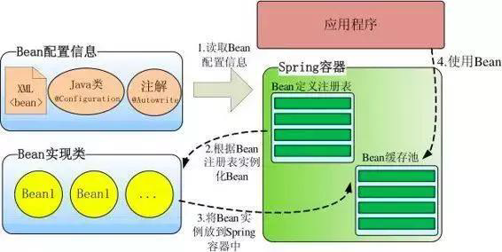
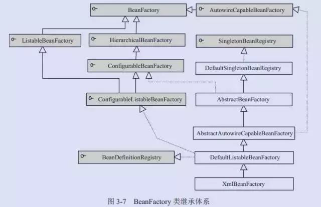
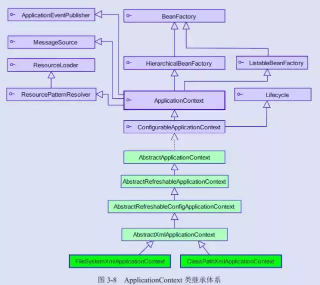
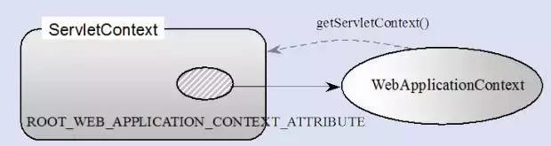
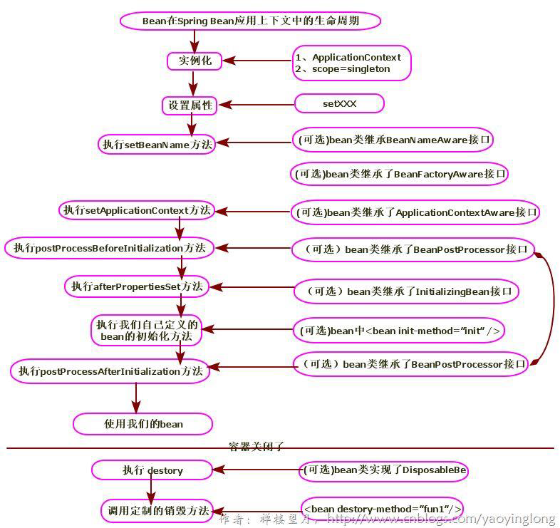

Spring IOC
====
### 原理
Spring 通过一个配置文件描述 Bean 及 Bean 之间的依赖关系，利用 Java 语言的反射功能实例化Bean 并建立 Bean 之间的依赖关系。 Spring 的 IoC 容器在完成这些底层工作的基础上，还提供了 Bean 实例缓存、生命周期管理、 Bean 实例代理、事件发布、资源装载等高级服务。
### Spring 高层容器识图
Spring 启动时读取应用程序提供的Bean 配置信息，并在Spring 容器中生成一份相应的Bean 配置注册表，然后根据这张注册表实例化Bean，装配好Bean 之间的依赖关系，为上层应用提供准备就绪的运行环境。其中Bean 缓存池为HashMap 实现。


### IOC 容器实现
#### BeanFactory-框架基础设施
BeanFactory 是 Spring 框架的基础设施，面向 Spring 本身；ApplicationContext 面向使用Spring 框架的开发者，几乎所有的应用场合我们都直接使用 ApplicationContext 而非底层的 BeanFactory。

* BeanDefinitionRegistry 注册表
Spring 配置文件中每一个节点元素在 Spring 容器里都通过一个 BeanDefinition 对象表示，它描述了 Bean 的配置信息。而BeanDefinitionRegistry 接口提供了向容器手工注册BeanDefinition 对象的方法。
* BeanFactory 顶层接口
位于类结构树的顶端 ，它最主要的方法就是 getBean(String beanName)，该方法从容器中返回特定名称的 Bean，BeanFactory 的功能通过其他的接口得到不断扩展。
* ListableBeanFactory
该接口定义了访问容器中 Bean 基本信息的若干方法，如查看Bean 的个数、获取某一类型Bean 的配置名、查看容器中是否包括某一 Bean 等方法。
* HierarchicalBeanFactory父子级联
父子级联 IoC 容器的接口，子容器可以通过接口方法访问父容器； 通过HierarchicalBeanFactory 接口， Spring 的 IoC 容器可以建立父子层级关联的容器体系，子容器可以访问父容器中的 Bean，但父容器不能访问子容器的 Bean。Spring 使用父子容器实现了很多功能，比如在 Spring MVC 中，展现层 Bean 位于一个子容器中，而业务层和持久层的 Bean 位于父容器中。这样，展现层 Bean 就可以引用业务层和持久层的 Bean，而业务层和持久层的 Bean 则看不到展现层的 Bean。
* ConfigurableBeanFactory
是一个重要的接口，增强了 IoC 容器的可定制性，它定义了设置类装载器、属性编辑器、容器初始化后置处理器等方法；
* AutowireCapableBeanFactory 自动装配
定义了将容器中的 Bean 按某种规则（如按名字匹配、按类型匹配等）进行自动装配的方法；
* SingletonBeanRegistry 运行期间注册单例 Bean
定义了允许在运行期间向容器注册单实例 Bean 的方法；对于单实例（ singleton）的 Bean来说，BeanFactory 会缓存 Bean 实例，所以第二次使用 getBean() 获取 Bean 时将直接从IoC 容器的缓存中获取 Bean 实例。Spring 在 DefaultSingletonBeanRegistry 类中提供了一个用于缓存单实例 Bean 的缓存器，它是一个用HashMap 实现的缓存器，单实例的 Bean 以beanName 为键保存在这个HashMap 中。
* 依赖日志框框
在初始化 BeanFactory 时，必须为其提供一种日志框架，比如使用Log4J，即在类路径下提供 Log4J 配置文件，这样启动 Spring 容器才不会报错。

#### ApplicationContext 面向应用开发
ApplicationContext 由 BeanFactory 派生而来， 提供了更多面向实际应用的功能。ApplicationContext 继承了 HierarchicalBeanFactory 和 ListableBeanFactory 接口，在此基础上，还通过多个其他的接口扩展了 BeanFactory 的功能：

* ClassPathXmlApplicationContext：默认从类路径加载配置文件
* FileSystemXmlApplicationContext：默认从文件系统中装载配置文件
* ApplicationEventPublisher：让容器拥有发布应用上下文事件的功能，包括容器启动事件、关闭事件等。
* MessageSource：为应用提供 i18n 国际化消息访问的功能；
* ResourcePatternResolver ： 所 有 ApplicationContext 实现类都实现了类似于PathMatchingResourcePatternResolver 的功能，可以通过带前缀的Ant 风格的资源文件路径装载 Spring 的配置文件。
* LifeCycle：该接口是 Spring 2.0 加入的，该接口提供了 start()和 stop()两个方法，主要用于控制异步处理过程。在具体使用时，该接口同时被ApplicationContext 实现及具体Bean 实现， ApplicationContext 会将 start/stop 的信息传递给容器中所有实现了该接口的 Bean，以达到管理和控制 JMX、任务调度等目的。
* ConfigurableApplicationContext 扩展于 ApplicationContext，它新增加了两个主要的方法： refresh()和 close()，让 ApplicationContext 具有启动、刷新和关闭应用上下文的能力。在应用上下文关闭的情况下调用 refresh()即可启动应用上下文，在已经启动的状态下，调用 refresh()则清除缓存并重新装载配置信息，而调用close()则可关闭应用上下文。

#### WebApplication 体系结构
WebApplicationContext 是专门为 Web 应用准备的，它允许从相对于 Web 根目录的路径中装载配置文件完成初始化工作。从WebApplicationContext 中可以获得ServletContext 的引用，整个 Web 应用上下文对象将作为属性放置到 ServletContext中，以便 Web 应用环境可以访问 Spring 应用上下文。

#### Spring Bean 作用域
Spring 3 中为Bean 定义了5 中作用域，分别为singleton（单例）、prototype（原型）、request、session 和global session，5 种作用域说明如下：
* singleton单例模式（多线程下不安全）
singleton：单例模式，Spring IoC 容器中只会存在一个共享的Bean 实例，无论有多少个Bean 引用它，始终指向同一对象。该模式在多线程下是不安全的。Singleton 作用域是Spring 中的缺省作用域，也可以显示的将Bean 定义为singleton 模式，配置为：
    ```java
    <bean id="userDao" class="com.ioc.UserDaoImpl" scope="singleton"/>
    ```
* prototype:原型链模式
prototype:原型模式，每次通过Spring 容器获取prototype 定义的bean 时，容器都将创建一个新的Bean 实例，每个Bean 实例都有自己的属性和状态，而singleton 全局只有一个对象。根据经验，对有状态的bean使用prototype作用域，而对无状态的bean使用singleton作用域。
* Request一次request一个实例
request：在一次Http 请求中，容器会返回该Bean 的同一实例。而对不同的Http 请求则会产生新的Bean，而且该bean 仅在当前Http Request 内有效,当前Http 请求结束，该bean实例也将会被销毁。
    ```java
    <bean id="loginAction" class="com.cnblogs.Login" scope="request"/>
    ```
* session
session：在一次Http Session 中，容器会返回该Bean 的同一实例。而对不同的Session 请求则会创建新的实例，该bean 实例仅在当前Session 内有效。同Http 请求相同，每一次session 请求创建新的实例，而不同的实例之间不共享属性，且实例仅在自己的session 请求内有效，请求结束，则实例将被销毁。
    ```java
    <bean id="userPreference" class="com.ioc.UserPreference" scope="session"/>
    ```
* global Session
global Session：在一个全局的Http Session 中，容器会返回该Bean 的同一个实例，仅在使用portlet context 时有效。

### Spring Bean 生命周期
* 实例化
  实例化一个Bean，也就是我们常说的new。

* IOC 依赖注入
  按照Spring 上下文对实例化的Bean 进行配置，也就是IOC 注入。

* setBeanName 实现
  如果这个Bean 已经实现了BeanNameAware 接口，会调用它实现的setBeanName(String)方法，此处传递的就是Spring 配置文件中Bean 的id 值
* BeanFactoryAware 实现
  如果这个Bean 已经实现了BeanFactoryAware 接口，会调用它实现的setBeanFactory，setBeanFactory(BeanFactory)传递的是Spring 工厂自身（可以用这个方式来获取其它Bean，只需在Spring 配置文件中配置一个普通的Bean 就可以）。
* ApplicationContextAware 实现
  如果这个Bean 已经实现了ApplicationContextAware 接口，会调用setApplicationContext(ApplicationContext)方法，传入Spring 上下文（同样这个方式也可以实现步骤4 的内容，但比4 更好，因为ApplicationContext 是BeanFactory 的子接口，有更多的实现方法）
* postProcessBeforeInitialization 接口实现--初始化预处理
  如果这个Bean 关联了BeanPostProcessor 接口，将会调用
postProcessBeforeInitialization(Object obj, String s)方法，BeanPostProcessor 经常被用作是Bean 内容的更改，并且由于这个是在Bean 初始化结束时调用那个的方法，也可以被应用于内存或缓存技术。
* init-method
  如果Bean 在Spring 配置文件中配置了init-method 属性会自动调用其配置的初始化方法。
* postProcessAfterInitialization
  如果这个Bean 关联了BeanPostProcessor 接口，将会调用postProcessAfterInitialization(Object obj, String s)方法。
注：以上工作完成以后就可以应用这个Bean 了，那这个Bean 是一个Singleton 的，所以一般情况下我们调用同一个id 的Bean 会是在内容地址相同的实例，当然在Spring 配置文件中也可以配置非Singleton。
* Destroy 过期自动清理阶段
  当Bean 不再需要时，会经过清理阶段，如果Bean 实现了DisposableBean 这个接口，会调用那个其实现的destroy()方法；
* destroy-method 自配置清理
  最后，如果这个Bean 的Spring 配置中配置了destroy-method 属性，会自动调用其配置的销毁方法。


Bean 标签有两个重要的属性（init-method 和destroy-method）。用它们你可以自己定制初始化和注销方法。它们也有相应的注解（@PostConstruct 和@PreDestroy）。
```java
<bean id="" class="" init-method="初始化方法" destroy-method="销毁方法">
```

### Spring Bean的注入方式
* 构造器注入
* setter注入
* 静态工厂注入
  ```java
    <bean name="springAction" class=" SpringAction" >
        <!--使用静态工厂注入，对应使用下面的文件-->
        <property name="staticFactoryDao" ref="staticFactoryDao"></property>
    </bean>
    <!--配置静态工厂-->
    <bean name="staticFactoryDao" class="DaoFactory" factory-method="getStaticFactoryDaoImpl"></bean>
  ```
* 实例工厂
  ```java
    <bean name="springAction" class="SpringAction">
        <!--使用实例工厂的方法注入对象,对应下面的配置文件-->
        <property name="factoryDao" ref="factoryDao"></property>
    </bean>
    <!--此处获取对象的方式是从工厂类中获取实例方法-->
    <bean name="daoFactory" class="com.DaoFactory"></bean>
    <bean name="factoryDao" factory-bean="daoFactory" factory-method="getFactoryDaoImpl"></bean>
  ```
  
### Bean的装配方式
Spring 装配包括手动装配和自动装配，手动装配是有基于xml 装配、构造方法、setter 方法等自动装配有五种自动装配的方式，可以用来指导Spring 容器用自动装配方式来进行依赖注入。
* no：默认的方式是不进行自动装配，通过显式设置ref 属性来进行装配。
* byName：通过参数名 自动装配，Spring 容器在配置文件中发现bean 的autowire 属性被设置成byname，之后容器试图匹配、装配和该bean 的属性具有相同名字的bean。
* byType：通过参数类型自动装配，Spring 容器在配置文件中发现bean 的autowire 属性被设置成byType，之后容器试图匹配、装配和该bean 的属性具有相同类型的bean。如果有多个bean 符合条件，则抛出错误。
* constructor：这个方式类似于byType， 但是要提供给构造器参数，如果没有确定的带参数的构造器参数类型，将会抛出异常。
* autodetect：首先尝试使用constructor 来自动装配，如果无法工作，则使用byType 方式。


