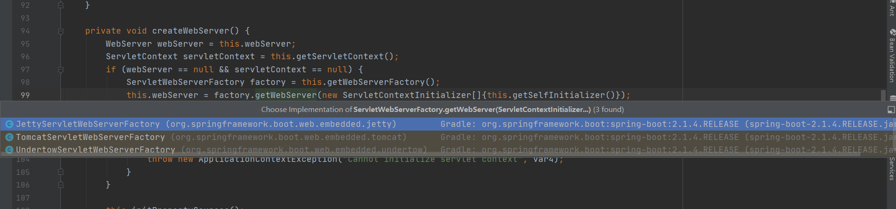

SpringBoot启动流程
===
#### 总览
 SpringBoot启动流程主要分为三个部分:
 * 第一部分进行SpringApplication的初始化模块，配置一些基本的环境变量、资源、构造器、监听器；
 * 第二部分实现了应用具体的启动方案，包括启动流程的监听模块、加载配置环境模块、及核心的创建上下文环境模块；
 * 第三部分是自动化配置模块。


#### 启动
每个SpringBoot程序都有一个主入口，也就是main方法，main里面调用SpringApplication.run()启动整个spring-boot程序，该方法所在类需要使用@SpringBootApplication注解，以及@ImportResource注解(if need)，@SpringBootApplication包括三个注解，功能如下：
* @EnableAutoConfiguration：SpringBoot根据应用所声明的依赖来对Spring框架进行自动配置
* @SpringBootConfiguration(内部为@Configuration)：被标注的类等于在spring的XML配置文件中(applicationContext.xml)，装配所有bean事务，提供了一个spring的上下文环境
* @ComponentScan：组件扫描，可自动发现和装配Bean，默认扫描SpringApplication的run方法里的Booter.class所在的包路径下文件，所以最好将该启动类放到根包路径下
```java
@SpringBootApplication
public class ZzbApp {
    /**
     * Main method, used to run the application.
     *
     * @param args the command line arguments
     */
    public static void main(String[] args) {
        SpringApplication.run(ConsumerApp.class, args);
    }
}
```
对照上面的典型代码，这个两个元素分别是：
* @SpringBootApplication
* SpringApplication 以及 run() 方法


#### 执行main方法
```java
public static void main(String[] args) {
    //代码很简单SpringApplication.run();
	SpringApplication.run(ConsumerApp.class, args);
}
```

```java
public static ConfigurableApplicationContext run(Class<?> primarySource,
			String... args) {
        //这个里面调用了run() 方法，我们转到定义
		return run(new Class<?>[] { primarySource }, args);
}
 
 
 
//这个run方法代码也很简单，就做了两件事情
//1、new了一个SpringApplication() 这么一个对象
//2、执行new出来的SpringApplication()对象的run()方法
public static ConfigurableApplicationContext run(Class<?>[] primarySources,
			String[] args) {
		return new SpringApplication(primarySources).run(args);
}

```
上面代码主要做了两件事情。
* 第一步new了一个SpringApplication对象 
* 第二步调用了run()方法。接下来我们一起看下new SpringApplication() 主要做了什么事情。
```java
public SpringApplication(ResourceLoader resourceLoader, Class<?>... primarySources) {
    this.resourceLoader = resourceLoader;
    Assert.notNull(primarySources, "PrimarySources must not be null");
    //1、先把主类保存起来
    this.primarySources = new LinkedHashSet<>(Arrays.asList(primarySources));
    //2、判断运行项目的类型
    this.webApplicationType = WebApplicationType.deduceFromClasspath();
    //3、扫描当前路径下META-INF/spring.factories文件的，加载ApplicationContextInitializer接口实例
    setInitializers((Collection) getSpringFactoriesInstances(ApplicationContextInitializer.class));
    //4、扫描当前路径下META-INF/spring.factories文件的，加载ApplicationListener接口实例
    setListeners((Collection) getSpringFactoriesInstances(ApplicationListener.class));
    this.mainApplicationClass = deduceMainApplicationClass();
}
```
利用SPI机制扫描 META-INF/spring.factories 这个文件，并且加载 ApplicationContextInitializer、ApplicationListener 接口实例。
* ApplicationContextInitializer 这个类当springboot上下文Context初始化完成后会调用
* ApplicationListener 当springboot启动时事件change后都会触发

总结：上面就是SpringApplication初始化的代码，new SpringApplication()没做啥事情 ，利用SPI机制主要加载了META-INF/spring.factories 下面定义的事件监听器接口实现类

#### 执行run() 方法
```java
public ConfigurableApplicationContext run(String... args) {
    <!--1、这个是一个计时器，没什么好说的-->
    StopWatch stopWatch = new StopWatch();
    stopWatch.start();
    ConfigurableApplicationContext context = null;
    Collection<SpringBootExceptionReporter> exceptionReporters = new ArrayList<>();
    
    <!--2、这个也不是重点，就是设置了一些环境变量-->
    configureHeadlessProperty();

    <!--3、获取事件监听器SpringApplicationRunListener类型，并且执行starting()方法-->
    SpringApplicationRunListeners listeners = getRunListeners(args);
    listeners.starting();
    try {
        <!--4、把参数args封装成DefaultApplicationArguments，这个了解一下就知道-->
        ApplicationArguments applicationArguments = new DefaultApplicationArguments(
                args);

        <!--5、这个很重要准备环境了，并且把环境跟spring上下文绑定好，并且执行environmentPrepared()方法-->
        ConfigurableEnvironment environment = prepareEnvironment(listeners,
                applicationArguments);

        <!--6、判断一些环境的值，并设置一些环境的值-->
        configureIgnoreBeanInfo(environment);

        <!--7、打印banner-->
        Banner printedBanner = printBanner(environment);

        <!--8、创建上下文，根据项目类型创建上下文-->
        context = createApplicationContext();

        <!--9、获取异常报告事件监听-->
        exceptionReporters = getSpringFactoriesInstances(
                SpringBootExceptionReporter.class,
                new Class[] { ConfigurableApplicationContext.class }, context);

        <!--10、准备上下文，执行完成后调用contextPrepared()方法,contextLoaded()方法-->
        prepareContext(context, environment, listeners, applicationArguments,
                printedBanner);

        <!--11、这个是spring启动的代码了，这里就回去里面就回去扫描并且初始化单实列bean了-->
        //这个refreshContext()加载了bean，还启动了内置web容器，需要细细的去看看
        refreshContext(context);

        <!--12、啥事情都没有做-->
        afterRefresh(context, applicationArguments);
        stopWatch.stop();
        if (this.logStartupInfo) {
            new StartupInfoLogger(this.mainApplicationClass)
                    .logStarted(getApplicationLog(), stopWatch);
        }

        <!--13、执行ApplicationRunListeners中的started()方法-->
        listeners.started(context);

        <!--执行Runner（ApplicationRunner和CommandLineRunner）-->
        callRunners(context, applicationArguments);
    }
    catch (Throwable ex) {
        handleRunFailure(context, listeners, exceptionReporters, ex);
        throw new IllegalStateException(ex);
    }
    listeners.running(context);
    return context;
}
```

该方法中实现了如下几个关键步骤：
* 创建了应用的监听器SpringApplicationRunListeners并开始监听
* 加载SpringBoot配置环境(ConfigurableEnvironment)，如果是通过web容器发布，会加载StandardEnvironment，其最终也是继承了ConfigurableEnvironment，类图如下：

可以看出，Environment最终都实现了PropertyResolver接口，我们平时通过environment对象获取配置文件中指定Key对应的value方法时，就是调用了propertyResolver接口的getProperty方法
* 配置环境(Environment)加入到监听器对象中(SpringApplicationRunListeners)
* 创建run方法的返回对象：ConfigurableApplicationContext(应用配置上下文)，我们可以看一下创建方法：
    ```java
    protected ConfigurableApplicationContext createApplicationContext() {
        Class<?> contextClass = this.applicationContextClass;
        if (contextClass == null) {
            try {
                switch(this.webApplicationType) {
                case SERVLET:
                    contextClass = Class.forName("org.springframework.boot.web.servlet.context.AnnotationConfigServletWebServerApplicationContext");
                    break;
                case REACTIVE:
                    contextClass = Class.forName("org.springframework.boot.web.reactive.context.AnnotationConfigReactiveWebServerApplicationContext");
                    break;
                default:
                    contextClass = Class.forName("org.springframework.context.annotation.AnnotationConfigApplicationContext");
                }
            } catch (ClassNotFoundException var3) {
                throw new IllegalStateException("Unable create a default ApplicationContext, please specify an ApplicationContextClass", var3);
            }
        }

        return (ConfigurableApplicationContext)BeanUtils.instantiateClass(contextClass);
    }
    ```
    方法会先获取显式设置的应用上下文(applicationContextClass)，如果不存在，再加载默认的环境配置（通过是否是web environment判断），默认选择AnnotationConfigApplicationContext注解上下文（通过扫描所有注解类来加载bean），最后通过BeanUtils实例化上下文对象，并返回，ConfigurableApplicationContext类图如下：
    
    主要看其继承的两个方向：
    * LifeCycle：生命周期类，定义了start启动、stop结束、isRunning是否运行中等生命周期空值方法
    * ApplicationContext：应用上下文类，其主要继承了beanFactory(bean的工厂类)
  
* prepareContext方法将listeners、environment、applicationArguments、banner等重要组件与上下文对象关联
* 接下来的refreshContext(context)方法(初始化方法如下)将是实现spring-boot-starter-*(mybatis、redis等)自动化配置的关键，包括spring.factories的加载，bean的实例化等核心工作。
    ```java
    private void refreshContext(ConfigurableApplicationContext context) {
        this.refresh(context);
        if (this.registerShutdownHook) {
            try {
                context.registerShutdownHook();
            } catch (AccessControlException var3) {
            }
        }

    }

    protected void refresh(ApplicationContext applicationContext) {
        Assert.isInstanceOf(AbstractApplicationContext.class, applicationContext);
        ((AbstractApplicationContext)applicationContext).refresh();
    }

    public void refresh() throws BeansException, IllegalStateException {
        synchronized(this.startupShutdownMonitor) {
            this.prepareRefresh();
            ConfigurableListableBeanFactory beanFactory = this.obtainFreshBeanFactory();
            this.prepareBeanFactory(beanFactory);

            try {
                this.postProcessBeanFactory(beanFactory);
                this.invokeBeanFactoryPostProcessors(beanFactory);
                this.registerBeanPostProcessors(beanFactory);
                this.initMessageSource();
                this.initApplicationEventMulticaster();
                this.onRefresh();
                this.registerListeners();
                this.finishBeanFactoryInitialization(beanFactory);
                this.finishRefresh();
            } catch (BeansException var9) {
                if (this.logger.isWarnEnabled()) {
                    this.logger.warn("Exception encountered during context initialization - cancelling refresh attempt: " + var9);
                }

                this.destroyBeans();
                this.cancelRefresh(var9);
                throw var9;
            } finally {
                this.resetCommonCaches();
            }

        }
    }
    ```
    主要看一下onRefresh() 这个方法。转到定义发现这个方法里面啥都没有，这明显是一个钩子方法，它会钩到它子类重写onRefresh()方法。所以去看子类里面的onRefresh()
    ```java
    protected void onRefresh() throws BeansException {
    }
    ```
    Web项目就去看 ServletWebServerApplicationContext 这个类
    
    ServletWebServerApplicationContext 这个类下面的 onRefresh() 方法
    ```java
    protected void onRefresh() {
        super.onRefresh();

        try {
            this.createWebServer();
        } catch (Throwable var2) {
            throw new ApplicationContextException("Unable to start web server", var2);
        }
    }

    private void createWebServer() {
        WebServer webServer = this.webServer;
        ServletContext servletContext = this.getServletContext();
        if (webServer == null && servletContext == null) {
            ServletWebServerFactory factory = this.getWebServerFactory();
            this.webServer = factory.getWebServer(new ServletContextInitializer[]{this.getSelfInitializer()});
        } else if (servletContext != null) {
            try {
                this.getSelfInitializer().onStartup(servletContext);
            } catch (ServletException var4) {
                throw new ApplicationContextException("Cannot initialize servlet context", var4);
            }
        }

        this.initPropertySources();
    }

    protected ServletWebServerFactory getWebServerFactory() {
        String[] beanNames = this.getBeanFactory().getBeanNamesForType(ServletWebServerFactory.class);
        if (beanNames.length == 0) {
            throw new ApplicationContextException("Unable to start ServletWebServerApplicationContext due to missing ServletWebServerFactory bean.");
        } else if (beanNames.length > 1) {
            throw new ApplicationContextException("Unable to start ServletWebServerApplicationContext due to multiple ServletWebServerFactory beans : " + StringUtils.arrayToCommaDelimitedString(beanNames));
        } else {
            return (ServletWebServerFactory)this.getBeanFactory().getBean(beanNames[0], ServletWebServerFactory.class);
        }
    }
    ```
    
    
    我们再回头去看factory.getWebServer(getSelfInitializer()
    
    看看tomcat内置服务器
    ```java
     public WebServer getWebServer(ServletContextInitializer... initializers) {
        Tomcat tomcat = new Tomcat();
        File baseDir = this.baseDirectory != null ? this.baseDirectory : this.createTempDir("tomcat");
        tomcat.setBaseDir(baseDir.getAbsolutePath());
        Connector connector = new Connector(this.protocol);
        tomcat.getService().addConnector(connector);
        this.customizeConnector(connector);
        tomcat.setConnector(connector);
        tomcat.getHost().setAutoDeploy(false);
        this.configureEngine(tomcat.getEngine());
        Iterator var5 = this.additionalTomcatConnectors.iterator();

        while(var5.hasNext()) {
            Connector additionalConnector = (Connector)var5.next();
            tomcat.getService().addConnector(additionalConnector);
        }

        this.prepareContext(tomcat.getHost(), initializers);
        return this.getTomcatWebServer(tomcat);
    }
    ```
    内置的Servlet容器就是在onRefresh() 方法里面启动的，至此一个Servlet容器就启动OK了


* 配置结束后，Springboot做了一些基本的收尾工作，返回了应用环境上下文。回顾整体流程，Springboot的启动，主要创建了配置环境(environment)、事件监听(listeners)、应用上下文(applicationContext)，并基于以上条件，在容器中开始实例化我们需要的Bean，至此，通过SpringBoot启动的程序已经构造完成

  ##### 总结
  * new了一个SpringApplication对象，使用SPI技术加载加载 ApplicationContextInitializer、ApplicationListener 接口实例
  * 调用SpringApplication.run() 方法
  * 调用createApplicationContext()方法创建上下文对象，创建上下文对象同时会注册spring的核心组件类（ConfigurationClassPostProcessor 、AutowiredAnnotationBeanPostProcessor 等）。
  * 调用refreshContext() 方法启动Spring容器和内置的Servlet容器
#### 自动配置
之前的启动结构图中，我们注意到无论是应用初始化还是具体的执行过程，都调用了SpringBoot自动配置模块

该配置模块的主要使用到了SpringFactoriesLoader，即Spring工厂加载器，该对象提供了loadFactoryNames方法，入参为factoryClass和classLoader，即需要传入上图中的工厂类名称和对应的类加载器，方法会根据指定的classLoader，加载该类加器搜索路径下的指定文件，即spring.factories文件，传入的工厂类为接口，而文件中对应的类则是接口的实现类，或最终作为实现类，所以文件中一般为如下图这种一对多的类名集合，获取到这些实现类的类名后，loadFactoryNames方法返回类名集合，方法调用方得到这些集合后，再通过反射获取这些类的类对象、构造方法，最终生成实例。
new SpringApplication()中加载配置的数据过程
```java
 public SpringApplication(ResourceLoader resourceLoader, Class<?>... primarySources) {
    this.sources = new LinkedHashSet();
    this.bannerMode = Mode.CONSOLE;
    this.logStartupInfo = true;
    this.addCommandLineProperties = true;
    this.addConversionService = true;
    this.headless = true;
    this.registerShutdownHook = true;
    this.additionalProfiles = new HashSet();
    this.isCustomEnvironment = false;
    this.resourceLoader = resourceLoader;
    Assert.notNull(primarySources, "PrimarySources must not be null");
    this.primarySources = new LinkedHashSet(Arrays.asList(primarySources));
    this.webApplicationType = WebApplicationType.deduceFromClasspath();
    // 获取初始化容器方法
    this.setInitializers(this.getSpringFactoriesInstances(ApplicationContextInitializer.class));
    // 获取监听
    this.setListeners(this.getSpringFactoriesInstances(ApplicationListener.class));
    this.mainApplicationClass = this.deduceMainApplicationClass();
}

// 获取SpringFactoriesInstances实例
private <T> Collection<T> getSpringFactoriesInstances(Class<T> type) {
    return this.getSpringFactoriesInstances(type, new Class[0]);
}

// 获取SpringFactoriesInstances实例
private <T> Collection<T> getSpringFactoriesInstances(Class<T> type, Class<?>[] parameterTypes, Object... args) {
    ClassLoader classLoader = this.getClassLoader();
    // 获取全路径类名
    Set<String> names = new LinkedHashSet(SpringFactoriesLoader.loadFactoryNames(type, classLoader));
    List<T> instances = this.createSpringFactoriesInstances(type, parameterTypes, classLoader, args, names);
    AnnotationAwareOrderComparator.sort(instances);
    return instances;
}

// 加载类
public static List<String> loadFactoryNames(Class<?> factoryClass, @Nullable ClassLoader classLoader) {
    String factoryClassName = factoryClass.getName();
    // 加载配置的类信息
    return (List)loadSpringFactories(classLoader).getOrDefault(factoryClassName, Collections.emptyList());
}

// 根据META-INFO/spring.factories中配置的类，进行加载
private static Map<String, List<String>> loadSpringFactories(@Nullable ClassLoader classLoader) {
    MultiValueMap<String, String> result = (MultiValueMap)cache.get(classLoader);
    if (result != null) {
        return result;
    } else {
        try {
            Enumeration<URL> urls = classLoader != null ? classLoader.getResources("META-INF/spring.factories") : ClassLoader.getSystemResources("META-INF/spring.factories");
            LinkedMultiValueMap result = new LinkedMultiValueMap();

            while(urls.hasMoreElements()) {
                URL url = (URL)urls.nextElement();
                UrlResource resource = new UrlResource(url);
                Properties properties = PropertiesLoaderUtils.loadProperties(resource);
                Iterator var6 = properties.entrySet().iterator();

                while(var6.hasNext()) {
                    Entry<?, ?> entry = (Entry)var6.next();
                    String factoryClassName = ((String)entry.getKey()).trim();
                    String[] var9 = StringUtils.commaDelimitedListToStringArray((String)entry.getValue());
                    int var10 = var9.length;

                    for(int var11 = 0; var11 < var10; ++var11) {
                        String factoryName = var9[var11];
                        result.add(factoryClassName, factoryName.trim());
                    }
                }
            }

            cache.put(classLoader, result);
            return result;
        } catch (IOException var13) {
            throw new IllegalArgumentException("Unable to load factories from location [META-INF/spring.factories]", var13);
        }
    }
}
```


mybatis-spring-boot-starter、spring-boot-starter-web等组件的META-INF文件下均含有spring.factories文件，自动配置模块中，SpringFactoriesLoader收集到文件中的类全名并返回一个类全名的数组，返回的类全名通过反射被实例化，就形成了具体的工厂实例，工厂实例来生成组件具体需要的bean。

##### EnableAutoConfiguration

可以发现其最终实现了ImportSelector(选择器)和BeanClassLoaderAware(bean类加载器中间件)，重点关注一下AutoConfigurationImportSelector的selectImports方法
```java
public String[] selectImports(AnnotationMetadata annotationMetadata) {
    if (!this.isEnabled(annotationMetadata)) {
        return NO_IMPORTS;
    } else {
        AutoConfigurationMetadata autoConfigurationMetadata = AutoConfigurationMetadataLoader.loadMetadata(this.beanClassLoader);
        AutoConfigurationImportSelector.AutoConfigurationEntry autoConfigurationEntry = this.getAutoConfigurationEntry(autoConfigurationMetadata, annotationMetadata);
        return StringUtils.toStringArray(autoConfigurationEntry.getConfigurations());
    }
}

protected AutoConfigurationImportSelector.AutoConfigurationEntry getAutoConfigurationEntry(AutoConfigurationMetadata autoConfigurationMetadata, AnnotationMetadata annotationMetadata) {
    if (!this.isEnabled(annotationMetadata)) {
        return EMPTY_ENTRY;
    } else {
        AnnotationAttributes attributes = this.getAttributes(annotationMetadata);
        List<String> configurations = this.getCandidateConfigurations(annotationMetadata, attributes);
        configurations = this.removeDuplicates(configurations);
        Set<String> exclusions = this.getExclusions(annotationMetadata, attributes);
        this.checkExcludedClasses(configurations, exclusions);
        configurations.removeAll(exclusions);
        configurations = this.filter(configurations, autoConfigurationMetadata);
        this.fireAutoConfigurationImportEvents(configurations, exclusions);
        return new AutoConfigurationImportSelector.AutoConfigurationEntry(configurations, exclusions);
    }
}

protected List<String> getCandidateConfigurations(AnnotationMetadata metadata, AnnotationAttributes attributes) {
    List<String> configurations = SpringFactoriesLoader.loadFactoryNames(this.getSpringFactoriesLoaderFactoryClass(), this.getBeanClassLoader());
    Assert.notEmpty(configurations, "No auto configuration classes found in META-INF/spring.factories. If you are using a custom packaging, make sure that file is correct.");
    return configurations;
}
```
该方法在springboot启动流程——bean实例化前被执行，返回要实例化的类信息列表。我们知道，如果获取到类信息，spring自然可以通过类加载器将类加载到jvm中，现在我们已经通过spring-boot的starter依赖方式依赖了我们需要的组件，那么这些组件的类信息在select方法中也是可以被获取到的