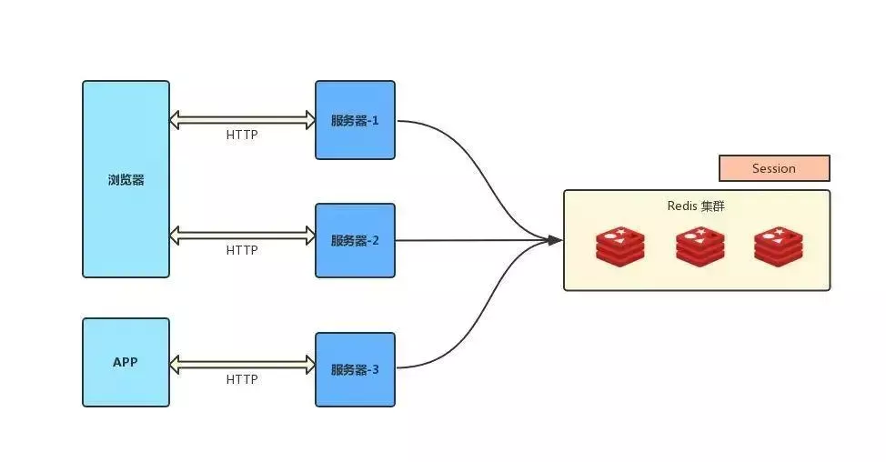

分布式架构下 session 共享方案
===
### session 复制
任何一个服务器上的 session 发生改变（增删改），该节点会把这个 session 的所有内容序列化，然后广播给所有其它节点，不管其他服务器需不需要 session ，以此来保证 session 同步

优点： 可容错，各个服务器间 session 能够实时响应。
缺点： 会对网络负荷造成一定压力，如果 session 量大的话可能会造成网络堵塞，拖慢服务器性能。

###  粘性 session /IP 绑定策略
采用 Ngnix 中的 ip_hash 机制，将某个 ip的所有请求都定向到同一台服务器上，即将用户与服务器绑定。 用户第一次请求时，负载均衡器将用户的请求转发到了 A 服务器上，如果负载均衡器设置了粘性 session 的话，那么用户以后的每次请求都会转发到 A 服务器上，相当于把用户和 A 服务器粘到了一块，这就是粘性 session 机制。

优点： 简单，不需要对 session 做任何处理。
缺点： 缺乏容错性，如果当前访问的服务器发生故障，用户被转移到第二个服务器上时，他的 session 信息都将失效。
适用场景： 发生故障对客户产生的影响较小；服务器发生故障是低概率事件 。
实现方式： 以 Nginx 为例，在 upstream 模块配置 ip_hash 属性即可实现粘性 session。

###  session 共享（常用）
使用分布式缓存方案比如 Memcached 、Redis 来缓存 session，但是要求 Memcached 或 Redis 必须是集群

把 session 放到 Redis 中存储，虽然架构上变得复杂，并且需要多访问一次 Redis ，但是这种方案带来的好处也是很大的：

实现了 session 共享；

可以水平扩展（增加 Redis 服务器）；

服务器重启 session 不丢失（不过也要注意 session 在 Redis 中的刷新/失效机制）；

不仅可以跨服务器 session 共享，甚至可以跨平台（例如网页端和 APP 端）

###  session 持久化
将 session 存储到数据库中，保证 session 的持久化

优点： 服务器出现问题，session 不会丢失
缺点： 如果网站的访问量很大，把 session 存储到数据库中，会对数据库造成很大压力，还需要增加额外的开销维护数据库。