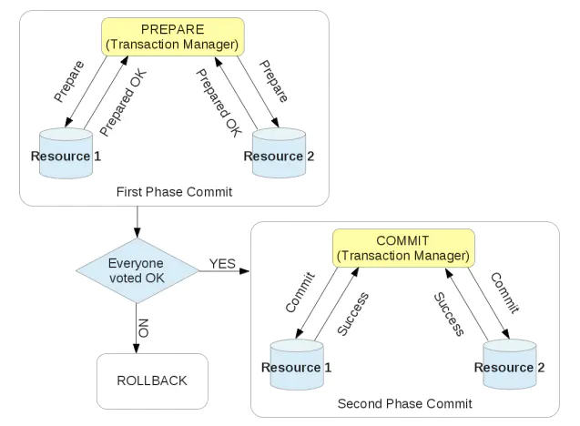
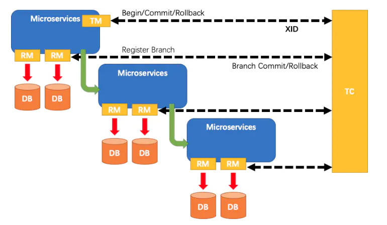
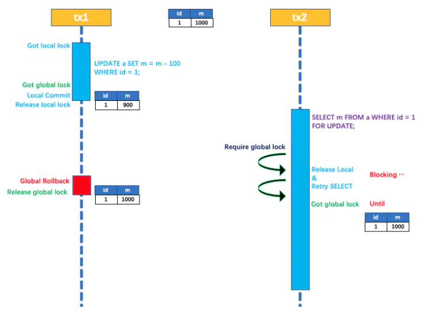
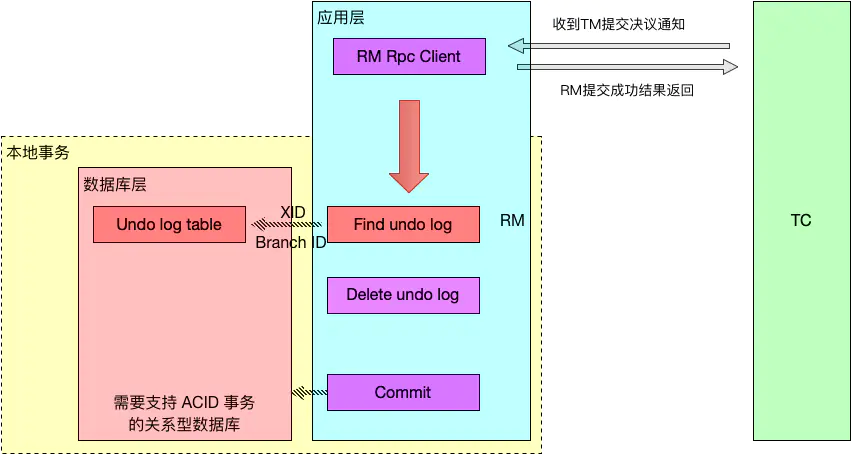
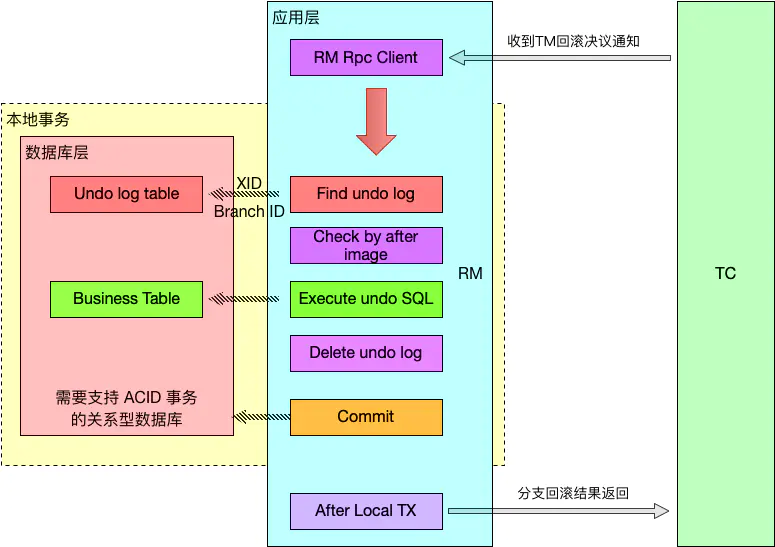
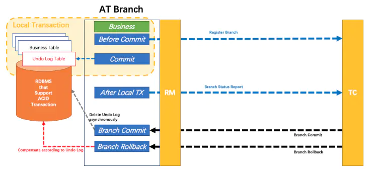
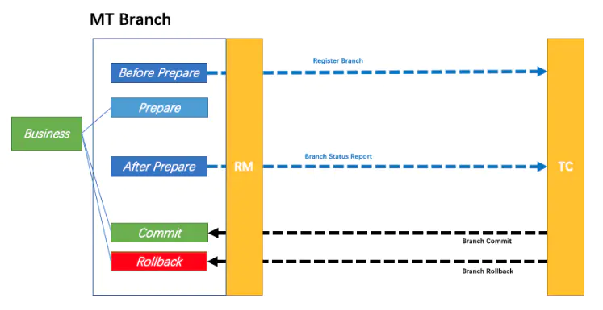
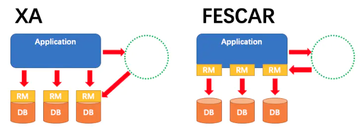
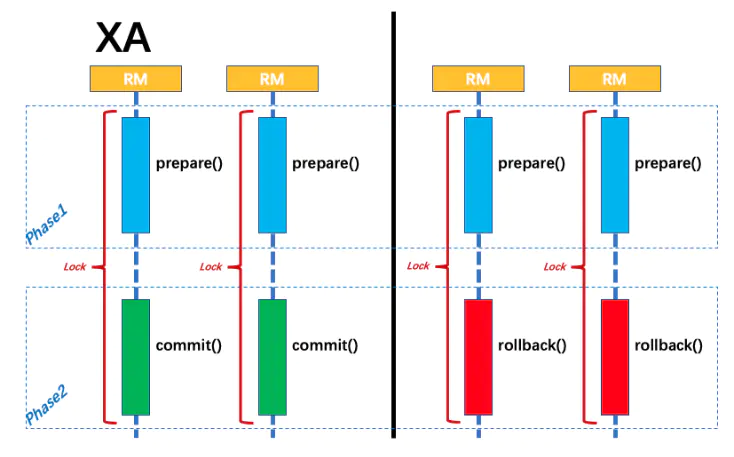
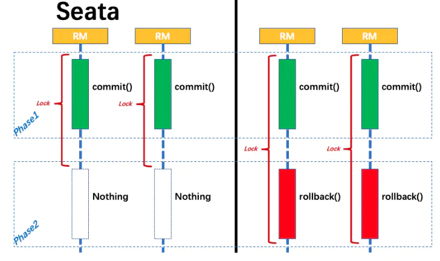

分布式事务--Seata
----
Seata框架是一个业务层的XA（两阶段提交）解决方案。

### XA

1. MySQL XA方案
MySQL从5.7开始加入了分布式事务的支持。MySQL XA中拥有两种角色：
* RM（Resource Manager）：用于直接执行本地事务的提交和回滚。在分布式集群中，一台MySQL服务器就是一个RM。
* TM（Transaction Manager）：TM是分布式事务的核心管理者。事务管理器与每个RM进行通信，协调并完成分布式事务的处理。发起一个分布式事务的MySQL客户端就是一个TM。
  
XA的两阶段提交分为Prepare阶段和Commit阶段，过程如下：
* 阶段一为准备（prepare）阶段。即所有的RM锁住需要的资源，在本地执行这个事务（执行sql，写redo/undo log等），但不提交，然后向Transaction Manager报告已准备就绪。
* 阶段二为提交阶段（commit）。当Transaction Manager确认所有参与者都ready后，向所有参与者发送commit命令。



MySQL XA拥有严重的性能问题。一个数据库的事务和多个数据库间的XA事务性能对比可发现，性能差10倍左右。另外，XA过程中会长时间的占用资源（加锁）直到两阶段提交完成才释放资源。

### Seata
Seata的分布式事务解决方案是业务层面的解决方案，只依赖于单台数据库的事务能力。Seata框架中一个分布式事务包含3中角色：
* Transaction Coordinator (TC)： 事务协调器，维护全局事务的运行状态，负责协调并驱动全局事务的提交或回滚。
* Transaction Manager (TM)： 控制全局事务的边界，负责开启一个全局事务，并最终发起全局提交或全局回滚的决议。
* Resource Manager (RM)： 控制分支事务，负责分支注册、状态汇报，并接收事务协调器的指令，驱动分支（本地）事务的提交和回滚。

其中，TM是一个分布式事务的发起者和终结者，TC负责维护分布式事务的运行状态，而RM则负责本地事务的运行。如下图所示：


下面是一个分布式事务在Seata中的执行流程：
* TM 向 TC 申请开启一个全局事务，全局事务创建成功并生成一个全局唯一的 XID。
* XID 在微服务调用链路的上下文中传播。
* RM 向 TC 注册分支事务，接着执行这个分支事务并提交（重点：RM在第一阶段就已经执行了本地事务的提交/回滚），最后将执行结果汇报给TC。
* TM 根据 TC 中所有的分支事务的执行情况，发起全局提交或回滚决议。
* TC 调度 XID 下管辖的全部分支事务完成提交或回滚请求。

##### 为什么Seata在第一阶段就直接提交了分支事务？
Seata能够在第一阶段直接提交事务，是因为Seata框架为每一个RM维护了一张UNDO_LOG表（这张表需要客户端自行创建），其中保存了每一次本地事务的回滚数据。因此，二阶段的回滚并不依赖于本地数据库事务的回滚，而是RM直接读取这张UNDO_LOG表，并将数据库中的数据更新为UNDO_LOG中存储的历史数据。
如果第二阶段是提交命令，那么RM事实上并不会对数据进行提交（因为一阶段已经提交了），而实发起一个异步请求删除UNDO_LOG中关于本事务的记录。
由于Seata一阶段直接提交了本地事务，因此会造成隔离性问题，因此Seata的默认隔离级别为Read Uncommitted。然而Seata也支持Read Committed的隔离级别，我们会在下文中介绍如何实现。

##### Seata执行流程
下面是一个Seata中一个分布式事务执行的详细过程：
* 首先TM 向 TC 申请开启一个全局事务，全局事务创建成功并生成一个全局唯一的 XID。
* XID 在微服务调用链路的上下文中传播。
* RM 开始执行这个分支事务，RM首先解析这条SQL语句，生成对应的UNDO_LOG记录。下面是一条UNDO_LOG中的记录：
```json
{
    "branchId": 641789253,
    "undoItems": [{
        "afterImage": {
            "rows": [{
                "fields": [{
                    "name": "id",
                    "type": 4,
                    "value": 1
                }, {
                    "name": "name",
                    "type": 12,
                    "value": "GTS"
                }, {
                    "name": "since",
                    "type": 12,
                    "value": "2014"
                }]
            }],
            "tableName": "product"
        },
        "beforeImage": {
            "rows": [{
                "fields": [{
                    "name": "id",
                    "type": 4,
                    "value": 1
                }, {
                    "name": "name",
                    "type": 12,
                    "value": "TXC"
                }, {
                    "name": "since",
                    "type": 12,
                    "value": "2014"
                }]
            }],
            "tableName": "product"
        },
        "sqlType": "UPDATE"
    }],
    "xid": "xid:xxx"
}
```
可以看到，UNDO_LOG表中记录了分支ID，全局事务ID，以及事务执行的redo和undo数据以供二阶段恢复。
* RM在同一个本地事务中执行业务SQL和UNDO_LOG数据的插入。在提交这个本地事务前，RM会向TC申请关于这条记录的全局锁。如果申请不到，则说明有其他事务也在对这条记录进行操作，因此它会在一段时间内重试，重试失败则回滚本地事务，并向TC汇报本地事务执行失败。如下图所示：

* RM在事务提交前，申请到了相关记录的全局锁，因此直接提交本地事务，并向TC汇报本地事务执行成功。此时全局锁并没有释放，全局锁的释放取决于二阶段是提交命令还是回滚命令。
* TC根据所有的分支事务执行结果，向RM下发提交或回滚命令。
* RM如果收到TC的提交命令，首先立即释放相关记录的全局锁，然后把提交请求放入一个异步任务的队列中，马上返回提交成功的结果给 TC。异步队列中的提交请求真正执行时，只是删除相应 UNDO LOG 记录而已。

* RM如果收到TC的回滚命令，则会开启一个本地事务，通过 XID 和 Branch ID 查找到相应的 UNDO LOG 记录。将 UNDO LOG 中的后镜与当前数据进行比较，如果有不同，说明数据被当前全局事务之外的动作做了修改。这种情况，需要根据配置策略来做处理。否则，根据 UNDO LOG 中的前镜像和业务 SQL 的相关信息生成并执行回滚的语句并执行，然后提交本地事务达到回滚的目的，最后释放相关记录的全局锁。


##### Seata隔离级别
Seata由于一阶段RM自动提交本地事务的原因，默认隔离级别为Read Uncommitted。如果希望隔离级别为Read Committed，那么可以使用SELECT...FOR UPDATE语句。Seata引擎重写了SELECT...FOR UPDATE语句执行逻辑，SELECT...FOR UPDATE 语句的执行会申请 全局锁 ，如果 全局锁 被其他事务持有，则释放本地锁（回滚 SELECT...FOR UPDATE 语句的本地执行）并重试。这个过程中，查询是被 block 住的，直到 全局锁 拿到，即读取的相关数据是已提交的才返回。

出于总体性能上的考虑，Seata 目前的方案并没有对所有 SELECT 语句都进行代理，仅针对 FOR UPDATE 的 SELECT 语句。

### Seata支持的模式
上文中我们提到的Seata流程只是Seata支持的一种分布式事务模式，称为AT模式。它依赖于RM拥有本地数据库事务的能力，对于客户业务无侵入性。如图所示：

AT模式中业务逻辑不需要关注事务机制，分支与全局事务的交互过程自动进行。

另外，Seata还支持MT模式。MT模式本质上是一种TCC方案，业务逻辑需要被拆分为 Prepare/Commit/Rollback 3 部分，形成一个 MT 分支，加入全局事务。如图所示：

MT 模式一方面是 AT 模式的补充。另外，更重要的价值在于，通过 MT 模式可以把众多非事务性资源纳入全局事务的管理中。

### XA和Seata AT的对比

如图所示，XA 方案的 RM 实际上是在数据库层，RM 本质上就是数据库自身（通过提供支持 XA 的驱动程序来供应用使用）。而 Seata 的 RM 是以二方包的形式作为中间件层部署在应用程序这一侧的，不依赖与数据库本身对协议的支持，当然也不需要数据库支持 XA 协议。这点对于微服务化的架构来说是非常重要的：应用层不需要为本地事务和分布式事务两类不同场景来适配两套不同的数据库驱动。

另外，XA方案无论 Phase2 的决议是 commit 还是 rollback，事务性资源的锁都要保持到 Phase2 完成才释放。而对于Seata，将锁分为了本地锁和全局锁，本地锁由本地事务管理，在分支事务Phase1结束时就直接释放。而全局锁由TC管理，在决议 Phase2 全局提交时，全局锁马上可以释放。只有在决议全局回滚的情况下，全局锁 才被持有至分支的 Phase2 结束。因此，Seata对于资源的占用时间要少的多。对比如下图所示：




